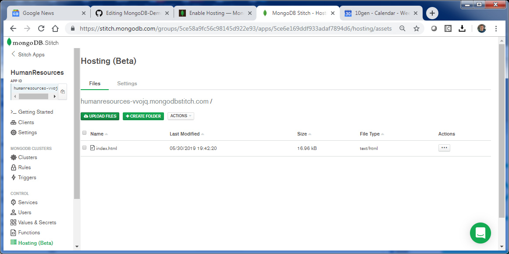
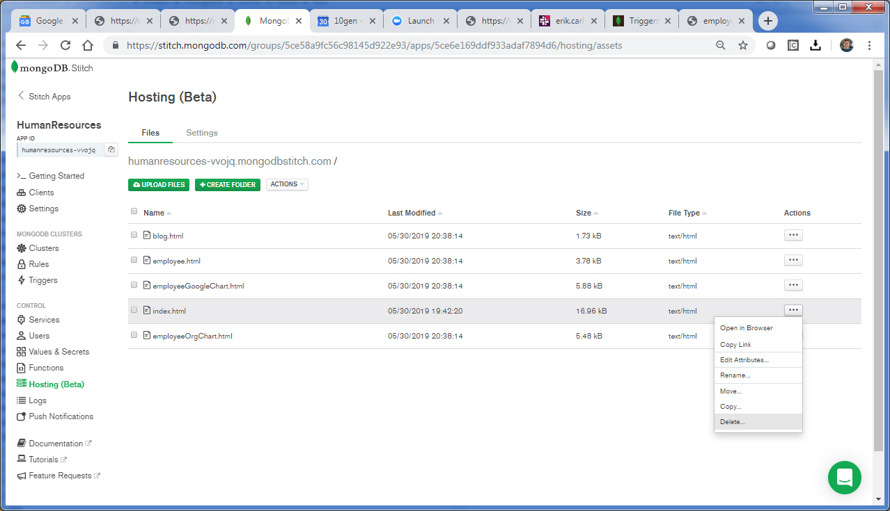

# Shipping: Hosting your Query Anywhere html application
_Solution Architect Author_: [Britton LaRoche](mailto:britton.laroche@mongodb.com)   

## Tutorial Contents 
(Note: All HR tutorials are hands on and should take an estimated time of less than 20 minutes)
1. [Overview](../../)
2. [Accesing shipment data through a REST based API](../rest/README.md)
3. [Triggers and Functions](../triggers/README.md)
4. [Query Anywhere](../queryAnywhere/README.md)
5. [Importing from GitHub: Stitch Command Line tool](../cli/README.md)
6. [Host your application tutorial](../hosting/README.md)  


Follow instructions for the [HR Hosting tutorial](../../../../Stitch/hosting/README.md).  

### Hosting Overview
Stitch Hosting allows you to host, manage, and serve your application’s static media and document files. You can use Hosting to store individual pieces of content or to upload and serve your entire client application. Stitch hosts your application’s content behind a unique domain name. By default, Stitch uses domains of the following form: ```<Your App ID>.mongodbstitch.com```. You can configure Stitch to host content at a custom domain name that you own in addition to the default hosting domain.

For further infromation read the [hosting documentaion](https://docs.mongodb.com/stitch/hosting/) for an overview. Its a two step process to [enable hosting](https://docs.mongodb.com/stitch/hosting/enable-hosting/) and then [upload content](https://docs.mongodb.com/stitch/hosting/upload-content-to-stitch/). 

### 1. Enable hosting
Navigate to the Hosting Configuration Page:   
To open the hosting configuration page, click "Hosting" in the left-hand navigation of the Stitch UI.


On the Hosting configuration page, click Enable Hosting. Stitch will begin provisioning hosting for your application.  You can no access your defaul index page by typing inthe following url into your browser:

 ```<your-app-id>.mongodbstitch.com```
 

### 2. Upload your files


Press the button labeled __"upload your files"__ and select all the html files you have been working on.   

We will upload the files in this [html directory](../../html/)

__drop-down-arrow.png__   
__index.html__   
__loading.gif__   
__logo.png__   
__postrapper.html__   
__ship.css__   

Click the image files and right click save as.  Edit the text files (html and css) and cut paste the contents then save the file with the correct name.  Alternatively you can download the project as a zip file and navigate to (extract path)/MongoDB-Demos/Applications/Shipping/html/

You can now access them at <your-app-id>..mongodbstitch.com!  For example try   
  
 ```<your-app-id>.mongodbstitch.com/blog.html```
 



Lets see your new employee app in action! Type in the default address 

 ```<your-app-id>.mongodbstitch.com```

Notice how you can access the database directly from the web.  __***Note:***__  you may need to select the  __"Actions"__ drop list in the hosting console and "Flush CDN Cache" to view your changes.


We will upload the files in this [html directory](../../html/)
