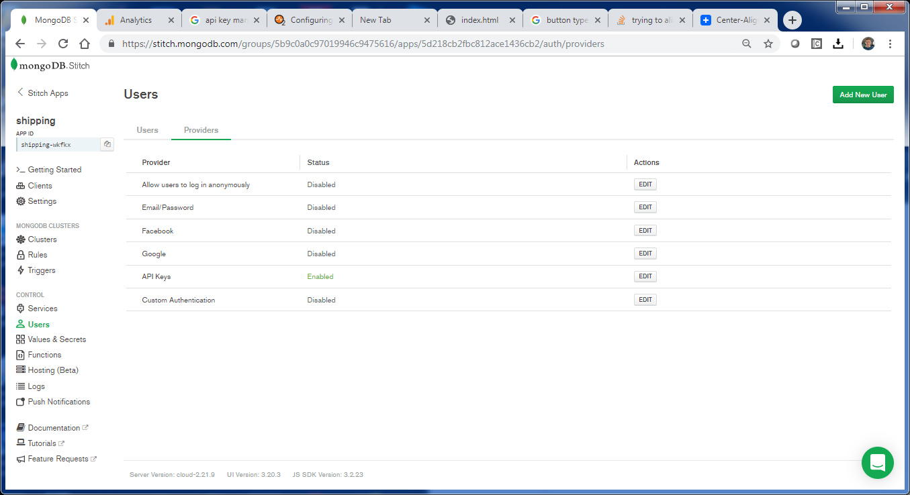

# Shipping: QueryAnywhere
_Solution Architect Author_: [Britton LaRoche](mailto:britton.laroche@mongodb.com)   

## Tutorial Contents 
(Note: All HR tutorials are hands on and should take an estimated time of less than 20 minutes)
1. [Overview](../../)
2. [Accesing shipment data through a REST based API](../rest/README.md)
3. [Triggers and Functions](../triggers/README.md)
4. [QueryAnywhere](../queryAnywhere/README.md)
5. [Importing from GitHub: Stitch Command Line tool](../cli/README.md)
6. [Host your application tutorial](../hosting/README.md)  

## Overview
Each module in this shipping tutorial builds on the last.  In this section we will cover QueryAnywhere through the Stitch browser SDK.  We will use Mongo Query Language (MQL) directly against the database.  We will use the browser SDK to remotley call functions we created in the earlier sections. We will also show how to make a REST API call through javascript.  The functions and rest calls have been created in sections 2 [Accesing shipment data through a REST based API](../rest/README.md) and 3 [Triggers and Functions](../triggers/README.md).

This section of the tutorial assumes you have completed the previous sections.

We begin by adding a bit of security and creating an apikey and assoicated user permissions.  This is not necessary as we could create an anonymous user, use a third party athentication method (facebook, google, AWS Cognito, JWT etc..)  Let us quickly explore our options.  Click on the __"Users"__ menu item in the left hand navigation pane in the stitch console.

