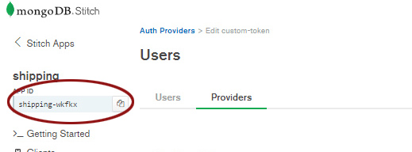
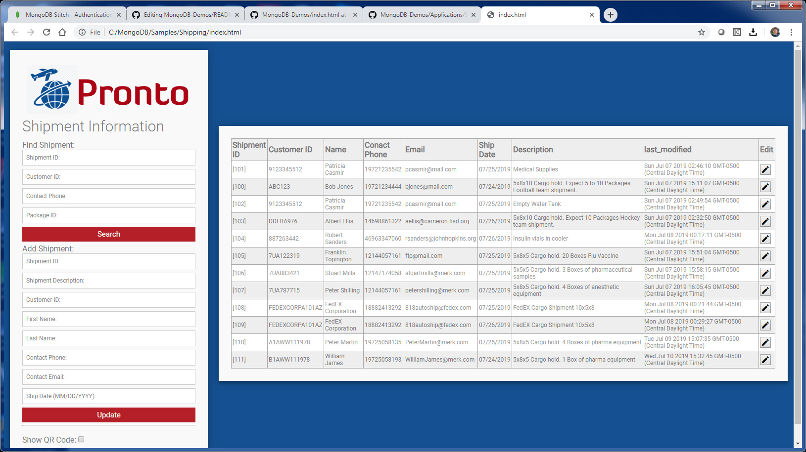
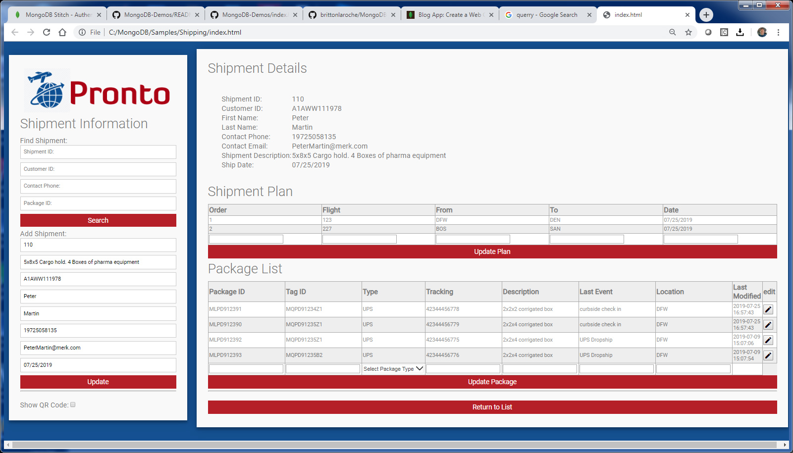

# Shipping: QueryAnywhere
_Solution Architect Author_: [Britton LaRoche](mailto:britton.laroche@mongodb.com)   

## Tutorial Contents 
(Note: All HR tutorials are hands on and should take an estimated time of less than 20 minutes)
1. [Overview](../../)
2. [Accesing shipment data through a REST based API](../rest/README.md)
3. [Triggers and Functions](../triggers/README.md)
4. [QueryAnywhere](../queryAnywhere/README.md)
5. [Importing from GitHub: Stitch Command Line tool](../cli/README.md)
6. [Host your application tutorial](../hosting/README.md)  


## Overview
Each module in this shipping tutorial builds on the last.  In this section we will cover QueryAnywhere through the Stitch browser SDK.  We will use Mongo Query Language (MQL) directly against the database.  We will use the browser SDK to remotley call functions we created in the earlier sections. We will also show how to make a REST API call through javascript.  The functions and rest calls have been created in sections 2 [Accesing shipment data through a REST based API](../rest/README.md) and 3 [Triggers and Functions](../triggers/README.md).

This section of the tutorial assumes you have completed the previous sections.

### 1. Create an API key
We begin by adding a bit of security and creating an API Key and assoicated user permissions.  This is not necessary as we could create an anonymous user, use a third party athentication method (facebook, google, AWS Cognito, JWT etc..)  Let us quickly explore our options.  Click on the __"Users"__ menu item in the left hand navigation pane in the stitch console.  The users window will display a list of users (we have not created any). Lets click the providers tab at the top of the users window.  We are presented with a list of options as seen below.


Third party providers such as facebook and google provide an excellent way for customers to access data and will be covered at a point in the future.  For now explore the custom option as you can see how to integrate with a Single Sign On (SSO) provider like AWS cognito, or something you are using in house through Java Web Tokens (JWT) as this eliminates the headache of user management for your application.

For now we will generate an API Key.  Select the __"API Keys"__ option and click the edit button.


Type in a name for the API Key, something like "BackOffice" or "WebAccess" and click save.  A private key will be displayed.  Copy that key and paste it into a text editor of your choice.  Then create the api key.  We will use that key to access the database through the stitch browser SDK.

### 2. Create the browser client application
You will need a text editor for this section. If you do not have a text editor we recommend downloading a free text editor from one of the following sites (VS Code is best for Developers):

[Notepad ++](https://notepad-plus-plus.org/download)   
[Brackets](http://brackets.io/)   
[VS Code](https://code.visualstudio.com/)   

The MongoDB stitch browser client sdk documentation is in this link here [MongoDB Stitch Browser SDK](https://docs.mongodb.com/stitch-sdks/js/4/index.html)  At the time of the writing of this tutorial we are on sdk version 4.4.0 

Navigate to the top section ofthis git hub or (right click "open in new tab") the link [MongoDB-Demos](https://github.com/brittonlaroche/MongoDB-Demos).  

Press the green box "Clone or Download" and select "Donwload Zip File" if you have not already.  Extract the zip file and navigate to the (unzip path)MongoDB-Demos/Applications/Shipping/html directory.  Here you will find the html file CSS file and images for our sample shipping application.  Alternatively you can view and copy the html and css files from (right click "open in new tab") [here](https://github.com/brittonlaroche/MongoDB-Demos/tree/master/Applications/Shipping/html).

Open the index.html file in the editor and replace 'your-app-id' with the application id of your shipping application and the 'your-api-Key' with the api key we just generated.  The APP-ID is located in the upper left of the stitch console as seen below, click the copy button to load it in your clip board for a quick paste.



```js
      const credential = new stitch.UserApiKeyCredential('your-api-key');
      const client = stitch.Stitch.initializeDefaultAppClient('your-app-id');
```

should look like 

```js
      const credential = new stitch.UserApiKeyCredential("y2yhO49BDf4zvQVnt5GEC0Ge90VJVsByuSGVVJAvUr4Z9tZjWvJ2iZiL8OhKKY9M");
      const client = stitch.Stitch.initializeDefaultAppClient('shipping-wkfpx');
```

Pasting the API key directly into the html is a bad idea.  There are a number of ways to properly manage and API Key and this is not one of them.  We highly recommend hidding and accessing this key according to best practices.  Unfortunatley we dont have access to any of those methods in this tutorial.  Just make a mental note that long term the API Key needs to be managed outside of the html source code and according to your organizations best practices.

Save the index.html and double click it.  You should see something like this:   



You might not have as many shipment records but you should have one or two from the previous examples.  If you are continually stuck with the loading page, you need to check your API key and APP-ID values and settings.  Check the console log.  In chrome the browser console is located under the menu item hamburger drop list --> More Tools --> Developer tools. 

### 3. Digging into QueryAnywhere
If this section consfuses you at any point, the best way to learn QueryAnywhere from scratch is to work through the blog tutorial.  Start with the [back end](https://docs.mongodb.com/stitch/tutorials/guides/blog-backend/) and finish with the [front end web client](https://docs.mongodb.com/stitch/tutorials/guides/blog-web/).  This QueryAnywhere tutorial's index.html evolved directly from the blog tutorial.  All that has changed is some additional fields, some dynamic html tables, a few image files, and a slick CSS style sheet.  We also added in a remote function call and the ability to make a REST API call.  Other than that its just the basic blog tutorial.

The rest of this tutorial will focus on explaining how the index.html works.  Lets start at the top.

```js
<html>
  <head>
    ...
    <script src="https://s3.amazonaws.com/stitch-sdks/js/bundles/4/stitch.js"></script>
    ...
```
The section above includes the stitch browser SDK.  All of the functions that allow us to query mongoDB directly and update data are contained in this java script file.  The next section below shows how we authenticate to the database using the API key and app id credentials.

```js
    <script>
      const credential = new stitch.UserApiKeyCredential('your-api-key');
      const client = stitch.Stitch.initializeDefaultAppClient('your-app-id');
      const db = client.getServiceClient(stitch.RemoteMongoClient.factory,"mongodb-atlas").db('ship');
      function displayShipmentsOnLoad() {
        client.auth
          .loginWithCredential(credential)
          .then(displayShipments)
          .catch(console.error);
      }
```


Notice that if any error is encountered with the log in the error should be logged in the browser console.  In chrome the browser console is located under the menu item hamburger drop list --> More Tools --> Developer tools. 

The database connection to our shipping application is defined in the follwoing code:
``` const db = client.getServiceClient(stitch.RemoteMongoClient.factory,"mongodb-atlas").db('ship');``` 

After connecting to the database the first function called is displayShipments. Notice the ".then" after connecting to the database.  The ".then" means the application waits for the connection to be complete and executes after the connection is succeful.

```js
          .loginWithCredential(credential)
          .then(displayShipments)
```

The first part of the display shipments builds a search document based on values in the input elements.  For example if we are looking for a particular customer id the following code finds the input value and creates a search document.

```js
        var sCust = document.getElementById('s_customer_id'); 
            ...
        if ( sCust.value != "") {
          searchDoc = {customer_id: sCust.value}; 
        }
```

The search document is placed into the find function as part of the mongo query language.   

``` db.collection('shipment').find(searchDoc, {limit: 1000}).asArray()```   

The code above perfoms a find on the shipment collection with the search document and limits the results to 1000. It then loops through the documents as an array and builds an html table to contain them.  This is stitch QueryAnywhere in action as we have turned our browser into a client application that can execute the mongo query language against the Atlas database.

```js
      function displayShipments() {
        var searchDoc = {};
        var sShip = document.getElementById('s_shipment_id'); 
        var sCust = document.getElementById('s_customer_id'); 
        var sPhone = document.getElementById('s_contact_phone');
        var sPkg = document.getElementById('s_package_id');
        var sShip = document.getElementById('s_shipment_id'); 
        if ( sCust.value != "") {
          searchDoc = {customer_id: sCust.value}; 
        }
        if ( sPhone.value != "") {
          searchDoc = {contact_phone: sPhone.value}; 
        }
        if ( sPkg.value != "") {
          searchDoc = { "packages.package_id": sPkg.value}; 
        }
        if ( parseInt(sShip.value) > 0) {
          searchDoc = {shipment_id: parseInt(sShip.value)}; 
        }
        const tStrt = "<div><table class=\"blueTable\"><th>Shipment ID</th><th>Customer ID</th><th>Name</th>" +
          "<th>Conact Phone</th><th>Email</th><th>Ship Date</th><th>Description</th><th>last_modified</th><th>Edit</th>";
          db.collection('shipment').find(searchDoc, {limit: 1000}).asArray()
            .then(docs => {
              const html = docs.map(c => "<tr>" +
                "<td>[" + c.shipment_id +  "]</td>" +
                "<td>" + c.customer_id +  "</td>" +
                "<td>" + c.first_name + " " + c.last_name + "</td>" +
                "<td>" + c.contact_phone + "</td>" + 
                "<td>" + c.contact_email + "</td>" +
                "<td>" + c.ship_date + "</td>" +
                "<td>" + c.description + "</td>" +
                "<td>" + c.last_modified + "</td>" +
                "<td> " + 
                "<button type=\"checkbox\" class=\"blueTable\"" +
                "onClick=\"editShipment(" + c.shipment_id +")\">" +
                "<i class=\"material-icons\" style=\"font-size:18px\">" +
                "mode_edit</i></button>" + 
                "</td>" +
                "</tr>").join("");
              document.getElementById("shipments").innerHTML = tStrt + html + "</table></div>";
          });
        }
```


Part of the html table is a column labeled "edit" which allows us to edit the plan and packages in the shipment.  Clicking the edit icon shows us this detailed shipping information.  In effect we have wrapped a gui around our shipping document.  The nested plan and package arrays have been turned into html tables with rows and columns.




The editShipment function has created the html tables that allow us to edit the plan and the packages directly.  
