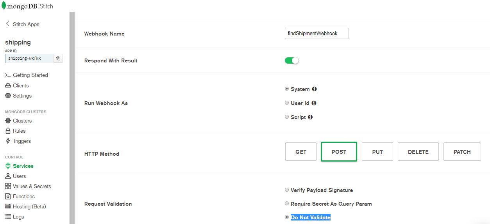
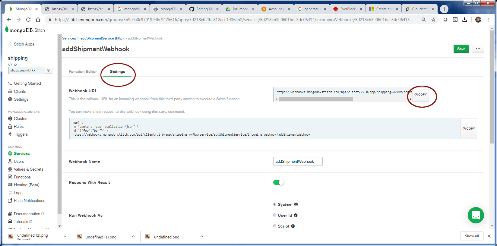
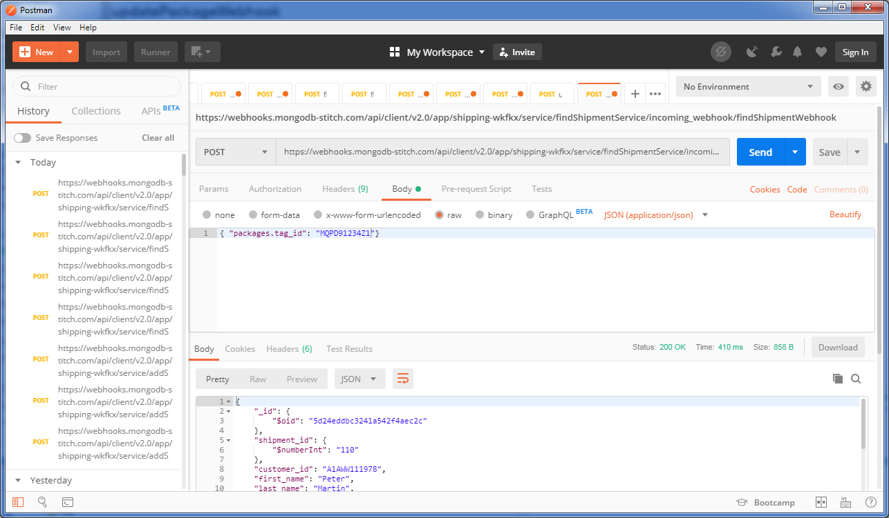
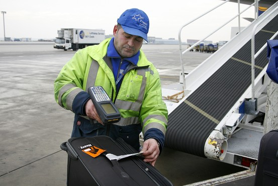

# Shipping Application - Accessing data through the Rest API
_Solution Architect Author_: [Britton LaRoche](mailto:britton.laroche@mongodb.com)   

## Tutorial Contents 
(Note: All HR tutorials are hands on and should take an estimated time of less than 20 minutes)
1. [Overview](../../)
2. [Accesing shipment data through a REST based API](../rest/README.md)
3. [Query Anywhere, Tiggers and Functions](../queryAnywhere/README.md)
4. [Importing from GitHub: Stitch Command Line tool](../cli/README.md)
5. [Host your application tutorial](../hosting/README.md)  

## Overview
This shipping application provides to methods of getting data into and out of the MongoDB database.  One is through a REST based API that we will create in this section of the tutorial.  The other method utilizes stitch "Query Anywhere" and allows us to use the stitch browser SDK to query the database directly.  Lets get started with the REST based API.


## Stitch Serverless Rest Based API

The diagram below shows how a third party shipping provider can interact with us through the REST based API utilizing stitch authentication to call a webhook that will insert and retrieve shipping documents.

   


We will focus on creating the findShipmentService, the addShipmentService, and the updatePackageService.  These services will have correespond webhooks that allow the third party shipping providers to access their data in our system.

### Prerequisites
[Postman](https://www.getpostman.com/downloads/) or curl.  You will need a method of making a post with a json document.   

### 1. Create a stitch function to query shipment data
log into the atlas console https://cloud.mongodb.com and click the "Stitch" menu item on the left. Select your stitch application "__shipping__." Select "functions" from the menu item on the left and create a new function named: __findShipment__   


Select "Functions" from the left navigation panel in the stitch console. Click the "Create New Function" button in the upper right corner.  Give the function a name __"findShipment"__ and click "Save."  This will bring up the function editor, cut and paste the code below and click "Save."
```js
exports = async function( aSearchDoc ){
  /*
    Accessing application's values:
    var x = context.values.get("value_name");

    Accessing a mongodb service:
    var collection = context.services.get("mongodb-atlas").db("dbname").collection("coll_name");
    var doc = collection.findOne({owner_id: context.user.id});

    To call other named functions:
    var result = context.functions.execute("function_name", arg1, arg2);

    Try running in the console below.
  */
  
  console.log(JSON.stringify("Function findShipment called ... executing..." ));
  var shipment = context.services.get("mongodb-atlas").db("ship").collection("shipment");
  var doc = shipment.findOne(aSearchDoc);
  console.log(JSON.stringify("return document" ));
  console.log(JSON.stringify(doc));
  return doc;
};
```

Notice that we made this function async in the declaration.  This will allow the calling function to await a database response while this function does the work to find the shipment specified.  The shipment search criteria is specified in the search document passed in as an argument.

### 2. Create a webhook to call the function to query shipment data
Create the __"findShipmentService"__    
Select "Services" from the left navigation panel in the Stitch Console.  Click the "Add a Service" button. In the add a service dialog select the "HTTP" button and give the service a name __"findShipmentService"__ and click the "Add Service" button.   


Create the __"findShipmentWebhook"__   
Next we add an incoming webhook.  The prompt screen should appear after saving the service.  Click the "Add Incoming Webhook" button. In the add webhook screen give the webhook a name __"findShipmentWebhook"__ and move the slider to "Respond with Result."  For now we will turn off validation. Click the save button.  



After saving the findShipmentWebhook the function editor is now present.  Cut and paste the code below and click "Save."

```js
// This function is the webhook's request handler.
exports = async function(payload) {
    // Data can be extracted from the request as follows:

    var body = {};
    var result = {};
    if (payload.body) {
      console.log(JSON.stringify(payload.body));
      body = EJSON.parse(payload.body.text());
      console.log(JSON.stringify(body));
      result = await context.functions.execute("findShipment", body);
    }
    
    return  result;
};
```

Notice that in our webhook function we take in the payload body, which should be a search document, and call our find shipment function created earlier.  Its a clean and easy way to reuse code.  If we need to alter the find logic we can do so in one function and all the services using the find function receive the alteration.  This ties together many concepts as findShipmentWebhook function calls the findShipment function asynchronously and awaits the result.  This is not the default behavior, to get the function to run asynchronously we have to add the following __"async"__ keyword to the function declaration.

We will test this function later with postman.  We dont have any data to query.  Lets add some shipment data!

### 3. Create a webhook to call the function add shipment data
Repeat steps 2 and 3 above above to create a new __"addShipmentService"__ and a new __"addShipmentWebhook"__,  in the webhook function editor cut and paste the code below.  

1. Create a new HTTP Service named: __addShipmentService__   
2. Create a new Webhook named: __addShipmentWebhook__   

After the webhook is created paste the following script into the __addShipmentWebhook__ function editor and click save. 

```js
exports = async function(payload) {
  var shipment = context.services.get("mongodb-atlas").db("ship").collection("shipment");
  console.log("Executing addShipmentWebhook");
  var queryArg = payload.query.arg || '';
  var body = {};
  var result = { "status": "Unknown: Payload body may be empty"};
  
  if (payload.body) {
    console.log(JSON.stringify(payload.body));
    body = EJSON.parse(payload.body.text());
    console.log(JSON.stringify(body));
    var nDate = new Date();
    //check the shipment_id
    if ( body.shipment_id ) {
        console.log("inserting shipment collection");
        result = await shipment.insertOne(body);
        console.log("after update");
    } else {
      result = { "status": "Error: shipment_id is not present"};
      return result;
    }
  }
  return  result;
};
```

The function above checks the payload body and for the presence of an shipment_id.  If either is missing it will return a document with a status of error or unknown.  If it is successful in creating the shipment, it will return the newly created document object_id.  If it encounters an error like a duplicate key it will return that error inofrmation in the result document.

```
exports = async function(payload) {
```

The standard is not to run in async mode.

```
exports = function(payload) {
```

The result for the default synchronous behavior would be an empty or undefined return document.  If you are not aware of the  __"async"__ keyword, which is required for database look ups when calling another function, it might take some time to figure out why the return document is always null or undefined.  

### 4. Test the REST based API add shipment service through postman
Our first step is to get the new URL for our addShipmentService. In the addShipmentWebhook console select the "Settings" tab and click the "Copy" button for the webhook URL.



Next we use postman to test our service. If you do not have Postman you can get Postman for free here [Postman Downloads](https://www.getpostman.com/downloads/).

Add a new tab and select "POST" from the drop list. Paste in the addShipmentWebhook URL.  Select the "Body" tab, and be sure to select RAW JSON(application/json). Click the save button and name it "AddShipment."   


Once postman is configured, use the json template below by pasting it in the postman body to add a new shipment. 
```js
{ 
	"shipment_id": 101,
	"customer_id": "A1AWW111978",
	"first_name": "Peter",
	"last_name": "Martin",
	"contact_phone": "19725058132",
	"contact_email": "PeterMartin@merk.com",
	"address": "1642 Smart Street, Frisco TX 75034",
	"description": "5x8x5 Cargo hold. 1 Box of pharma equipment",
	"ship_date": "07/25/2019",
	"last_modified": "07/25/2019",
	"plan": [
        {
            "order": "1",
            "flight": "123",
            "from": "DFW",
            "to": "DEN",
            "date": "07/25/2019"
        },
        {
            "order": "2",
            "flight": "227",
            "from": "BOS",
            "to": "SAN",
            "date": "07/25/2019"
        }
    ],
    "packages": [
    	{
            "package_id": "MLPD912391",
            "tag_id": "MQPD91234Z1",
            "type": "UPS",
            "tracking": "42344456778",
            "description": "2x2x2 corrigated box",
            "weight": "45 lbs",
            "last_event": "UPS Drop ship at airport",
            "location": "DFW",
            "last_modified": {
		        "$date": {
		            "$numberLong": "1564091863001"
		        }
		    }
        }
    ]
}
```
Change the shipment_id, package_id and tag_id to add more shipments.  Grab the example from the start of the start of the shipping tutorial and insert it too.

Note: you should create a unique index on shipment_id to avoid duplicates.  You can download [compass](https://www.mongodb.com/products/compass) for an easy gui interface to create the index.

After inserting some shipments the return document in postman informs you of a success or an error.  It would be great to see the documents.  Lets test our find function created earlier.

### 5. Test the search employee REST based API service through postman
Our first step, again is to get the new URL for our findShipmentService. In the findShipmentWebhook console select the "Settings" tab and click the "Copy" button for the webhook URL.

Open postman and add a new tab and select "POST" from the drop list. Paste in the URL.  Select the "Body" tab, and be sure to select RAW JSON(application/json). Click the save button and name it "Find Employee."

Use something like the following search document to find your employee.  Replace "Bob" with the first name you used in setting up your shipment data. Hit send and you should get your employee document back. Change first_name to "shipment_id" and play around with your data.  Or look for a tag id neste din the packages array.

``` { "first_name": "Bob"}```

``` { "packages.tag_id": "MQPD91234Z1"}```



## 6. Add an updatePackageService
Our shipment document has package information.  This shipment document has a good deal of information on the packages.  But with out realizing it we have already started using the [extended reference](https://www.mongodb.com/blog/post/building-with-patterns-the-extended-reference-pattern) design pattern.  Lets take a look at the document we expect in the shipping document and a guess at what our 3rd party shipper will provide.  Its possible they could rent a certain amount of square feet and esitmate a certian number of packages in the shipping document, but we wont know what they are until they arrive.  We must integrate these packages with the Pronto tag_id that will be placed on each package so that it can be scanned with the same scanners used to track passanger luggage.

```
    "packages": [
    	{
	    "shipment_id": "100",
            "package_id": "MLPD912391",
            "tag_id": "MQPD91234Z1",
            "type": "UPS",
            "tracking": "42344456778",
            "description": "2x2x2 corrigated box",
            "weight": "45 lbs",
            "last_event": "UPS Drop ship at airport",
            "location": "DFW",
            "last_modified": "07/25/2019"
        }
```

We can assume that we will get more information that we are not concerned about, but the required fields are the shipment_id (provided when they pucrhase the pronto service), the package_id and the tag_id.  The tag_id can be the same as the package_id or it can be generated by pronto when the package arrives.

Packages can be added and updated at any point in time during the journey.  To keep track of how long it takes to load the plane and the exact location of a package at any given point in time we will make copies of the package documents.  We will create a seperate package collection for this purpose and make updates to the shipping document as changes occur.

For now lets create the updatePackageService.  Repeat steps 2 and 3 above to create the  __"updatePackageService"__  and __"updatePackageWebhook"__

1. Create the __updatePackageService__  use the name __updatePackageService__ but follow the same settings for the addShipmentService in step 3 above.   

2. Create the __updatePackageWebhook__ follow the same steps and settings listed in step 4.  When you get to the webhook function editor paste in the following code.

```js
exports = async function(payload) {
  var cPackage = context.services.get("mongodb-atlas").db("ship").collection("package");
  console.log("Executing updatePackageWebhook");
  var queryArg = payload.query.arg || '';
  var body = {};
  var result = {"status": "Unknown: Payload body may be empty"};
  var currentPkgDoc = {};
  var updatePackageDoc = {};
  var searchDoc = {};
  
  if (payload.body) {
    console.log(JSON.stringify(payload.body));
    body = EJSON.parse(payload.body.text());
    console.log(JSON.stringify(body));
    var nDate = new Date();
    // ----------------------------------------------------------------------------------------------
    // this is an update from a webhook rest API that may not have all the information on the package
    // that we currently have. Abort if we dont have a shipment_id or package_id or tag_id
    //-----------------------------------------------------------------------------------------------
    if (body.shipment_id){
      //continue
    } else {
      result = { "status": "Error: shipment_id is not present"};
      return result;
    }
    if (body.tag_id){
      //continue
    } else {
      result = { "status": "Error: tag_id is not present"};
      return result;
    }
    
    //check the package_id
    if ( body.package_id ) {
        // Get current package from shipping document to insure we dont lose data 
        // Webhook may contain partial information  
        searchDoc = {"shipment_id": parseInt(body.shipment_id), "package_id": body.package_id};
        console.log("searchDoc");
        console.log(JSON.stringify(searchDoc));
        // The await should force a wait until the document is returned from the find function
        currentPkgDoc = await context.functions.execute("findPackage", searchDoc);
        if (currentPkgDoc){
          console.log("Current Package Found");
          console.log(JSON.stringify(currentPkgDoc));
        } else {
          console.log("Current Package NOT Found! Assuming new package is added to shipment.");
          currentPkgDoc = {};
        }
        //build an update document
        //if data is missing on the body set it to the currentPkgDoc
        if (body.owner_id) {
          updatePackageDoc.owner_id = body.owner_id;
        } else {
           if (currentPkgDoc.owner_id){updatePackageDoc.owner_id = currentPkgDoc.owner_id;}
        }
        if (body.type) {
          updatePackageDoc.type = body.type;
        } else {
           if (currentPkgDoc.type) {updatePackageDoc.type = currentPkgDoc.type;} 
        }
        if (body.tracking) {
          updatePackageDoc.tracking = body.tracking;
        } else {
           if (currentPkgDoc.tracking) {updatePackageDoc.tracking = currentPkgDoc.tracking;} 
        }
        if (body.description) {
          updatePackageDoc.description = body.description;
        } else {
           if (currentPkgDoc.description) {updatePackageDoc.description = currentPkgDoc.description;} 
        }
        if (body.last_event) {
          updatePackageDoc.last_event = body.last_event;
        } else {
           if (currentPkgDoc.last_event) {updatePackageDoc.last_event = currentPkgDoc.last_event};
        }
        if (body.location) {
          updatePackageDoc.location = body.location;
        } else {
           if(currentPkgDoc.location) {updatePackageDoc.location = currentPkgDoc.location;}
        }
        console.log("updating package collection");
        cPackage.updateOne(
          {package_id: body.package_id},
          {$set: {
              owner_id: updatePackageDoc.owner_id,
              shipment_id: parseInt(body.shipment_id),
              package_id: body.package_id,
              tag_id: body.tag_id,
              type: updatePackageDoc.type,
              tracking: updatePackageDoc.tracking,
              description: updatePackageDoc.description,
              last_event: updatePackageDoc.last_event,
              location: updatePackageDoc.location,
              last_modified: nDate,
              total_body: body
              }
          },
          {upsert: true}
        );
        console.log("after update");
    } else {
      result = { "status": "Error: package_id is not present"};
      return result;
    }

    // Let's return the document we find after updating the package 
    searchDoc = {"shipment_id": body.shipment_id, "package_id": body.package_id};
    result = await context.functions.execute("findPackage", searchDoc);
  }
  return  result;
};
```

We have made many checks to validate that we have required fields in our json document provided to the updatePackageWebhook function.  We have also taken great care to look up the existing package document and compare it to what we have been provided before we do the update.  If the new document is missing information for a partilcuar field and we are going to update that field in the package document we set it to the old value.



This same updatePackageWebhook can be called from 3rd party providers and from the bag scanners as the packages are loaded on to and off of the plane.  The scanner may provide the required information and the last event with location information, but it may not have any information on the tracking number for example. Additional information may be provided in the json document that we don't track so we store the total body of the document as well.


The next question is, how do we update the shipping document with the changes to the package document we just recived in the package collection?  The answer is through an atlas trigger.

## Next Steps
The next step is to insert the display the shipping document in an html application.  The html file will get data through the stitch browser SDK and utilize the query anywhere functionality.  Please click the link here [Query Anywhere, Tiggers and Functions](../queryAnywhere/README.md) to continue building the shipping application.  
