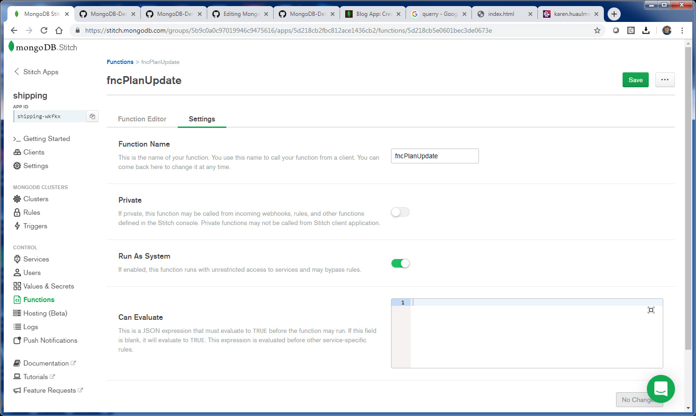
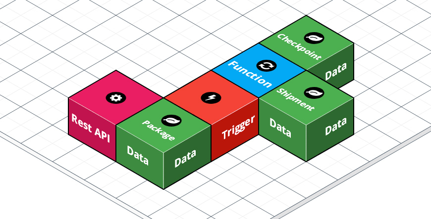

# Shipping: Triggers and Functions
_Solution Architect Author_: [Britton LaRoche](mailto:britton.laroche@mongodb.com)   

## Tutorial Contents 
(Note: The Triggers and Functions tutorial is hands on and should take an estimated time of less than 20 minutes)
1. [Overview](../../)
2. [Accessing shipment data through a REST based API](../rest/README.md)
3. [Triggers and Functions](../triggers/README.md)
4. [QueryAnywhere](../queryAnywhere/README.md)
4. [Importing from GitHub: Stitch Command Line tool](../cli/README.md)
5. [Host your application tutorial](../hosting/README.md)  


## Overview
We need to keep changes made to the package collection in sync with the shipping collection.  Our analysis shows that Pronto's shipping application will be 80% reads and 20% writes.  In order to make the reads efficent we will make changes on the shipping document through an Atlas trigger when the package collection is updated.


We will also update a checkpoint collection to implement the versioning design pattern.  We will keep a version of each document as it passes through each checkpoint.  Notice that the diagram above shows the Atlas trigger and fucntion executing in the stitch serverless framework.  The execution of the code in the trigger takes place outside of Atlas and will not impact database performance. 

## 1. Create the package trigger
We will create and atlas trigger __trgPackageCheckpoint__  that will call a function __fncPackageUpdate__   to update the shipment and checkpoint collections everytime the package collection is updated.

trigger name: __trgPackageCheckpoint__   
function name: __fncPackageUpdate__   
datbase name: __ship__   
collection name: __package__ 

Start by clicking the "triggers" menu item on the left hand navigation pane and then press the "create new trigger" button.  The trigger creation windw appears.  We need to configure the trigger with the following features, the name is __trgPackageCheckpoint__. Next we insure that the trigger is enabled and event ordering is turned on, these are the defaults.  We select mongodb-atlas as our linked cluster, datbase name is __ship__, collection name we are watching is __package__.  We want to capture the __Full Document__ make sure that slider is moved to the right and green.  We also want to capture information for any insert, update, delete or replace so make sure all those boxes are checked.

Next we want to link a new function so click the "+ New Function" in the select list and give the function name __fncPackageUpdate__.  A default function template is generated.  Click save. All that remains is writing the code for that function to update the checkpoint and shipment collections.


## 2. Write the package update function 
We just created the fucntion in the previous step.  Select the __"Functions"__ menu item in the left navigation pane of the stitch console.  A screen appears listing the functions for the stitch functions. Select fncPackageUpdate and copy / paste the following code over the default code in the function editor.

```js
exports = function(changeEvent) {
  /*
    A Database Trigger will always call a function with a changeEvent.
    Documentation on ChangeEvents: https://docs.mongodb.com/manual/reference/change-events/

    Access the _id of the changed document:
    var docId = changeEvent.documentKey._id;

    Access the latest version of the changed document
    (with Full Document enabled for Insert, Update, and Replace operations):
    var fullDocument = changeEvent.fullDocument;

    var updateDescription = changeEvent.updateDescription;

    See which fields were changed (if any):
    if (updateDescription) {
      var updatedFields = updateDescription.updatedFields; // A document containing updated fields
    }

    See which fields were removed (if any):
    if (updateDescription) {
      var removedFields = updateDescription.removedFields; // An array of removed fields
    }

    Functions run by Triggers are run as System users and have full access to Services, Functions, and MongoDB Data.

    Accessing a mongodb service:
    var collection = context.services.get("mongodb-atlas").db("db_name").collection("coll_name");
    var doc = collection.findOne({ name: "mongodb" });

    To call other named functions:
    var result = context.functions.execute("function_name", arg1, arg2);
  */


  console.log("Function fncPackageUpdate called ... executing..." );
  
  var shipment = context.services.get("mongodb-atlas").db("ship").collection("shipment");
  var checkpoint = context.services.get("mongodb-atlas").db("ship").collection("checkpoint");
  var fullDocument = changeEvent.fullDocument;
  var fullCopy = fullDocument;
  
  //update the shipping document with the new package information
  console.log("Shipment updateOne ... executing..." );
  console.log("fullDocument");
  console.log(JSON.stringify(fullDocument));
  shipment.updateOne(
  	{ shipment_id: parseInt(fullDocument.shipment_id) },
  	{ $pull: { "packages": { package_id: fullDocument.package_id } }	}
  );
  
  console.log("Shipment ... $addToSet..." );
  shipment.updateOne(
  	{ shipment_id: parseInt(fullDocument.shipment_id) },
  	{ $addToSet: { "packages": { 
  	  package_id: fullDocument.package_id, 
  	  tag_id: fullDocument.tag_id, 
  	  type: fullDocument.type, 
  	  tracking: fullDocument.tracking, 
  	  description: fullDocument.description, 
  	  last_event: fullDocument.last_event, 
  	  location: fullDocument.location, 
  	  last_modified: fullDocument.last_modified, 
  	  fullDocument } } }
  );
  
  //track all changes to the package in the checkpoint collection
  fullCopy.parent_id = fullDocument._id;
  delete fullCopy._id;
  checkpoint.insertOne(fullCopy);

};
```
__Important note__: Stitch functions are typically based off of an earlier code branch while development coninues on the core database. As such the stitch query language and functions may not have all of the current mongodb functions that are avilable via command line and the through the MongoDB driver when a new version of the database is released.  To see what functions are supported and which ones are being developed follow the link here: https://docs.mongodb.com/stitch/mongodb/crud-and-aggregation-apis/

In this example we do not have access to an easy to use function for updating arrays, known as arrayFilers. 

```
The following update command options are not supported:

bypassDocumentValidation
collation
arrayFilters
```

To handle the update to the shipment collection we pull the package and add it back to the array by using the array operators __$pull__ and __$addToSet__

```js
  shipment.updateOne(
  	{ shipment_id: parseInt(fullDocument.shipment_id) },
  	{ $pull: { "packages": { package_id: fullDocument.package_id } }	}
  );
  
  console.log("Shipment ... $addToSet..." );
  shipment.updateOne(
  	{ shipment_id: parseInt(fullDocument.shipment_id) },
  	{ $addToSet: { "packages": { 
  	  package_id: fullDocument.package_id, 
  	  tag_id: fullDocument.tag_id, 
  	  type: fullDocument.type, 
  	  tracking: fullDocument.tracking, 
  	  description: fullDocument.description, 
  	  last_event: fullDocument.last_event, 
  	  location: fullDocument.location, 
  	  last_modified: fullDocument.last_modified, 
  	  fullDocument } } }
  );
```

To handle the versioning of the package document we simple insert it into the checkpoint collection.  First we remove the ```_id``` field as there is a default unique index placed on that field.  We could only insert the package once into the checkpoint collection if we did not remove the ```_id```  field.  Upon insert into the checkpoint collection mongodb detects that the ```_id``` field is not present and a new ```_id``` is generated.  To maintain the relationship we add the old ```_id``` as __parent_id.

```js
  //track all changes to the package in the checkpoint collection
  fullCopy.parent_id = fullDocument._id;
  delete fullCopy._id;
  checkpoint.insertOne(fullCopy);
```

These sublte nuances are important in the package function and are explained here so that you are aware of why the function was written this way.

## 2. Write the plan update function 
We have two arrays in the shipment document one for plans and one for packages.  We create the package function update as part of a trigger.  Now we will create the plan function update as a standalone function.

Create new function called fncPlanUpdate to update the shipment plan.  Select the __"Functions"__ menu item in the left navigation pane of the stitch console.  A screen appears listing the functions for the stitch functions. Press the __"Create New Function"__ Button in the upper right.

Name the function __fncPlanUpdate__ and flip the slider to run as system.  



Save the function and paste the following code in the function editor.
```js
exports = async function(argPlanDoc){
  console.log("Function fncPlanUpdate called ... executing..." );
  var shipment = context.services.get("mongodb-atlas").db("ship").collection("shipment");
  var nDate = new Date();
  if (argPlanDoc){
    //update the shipping document with the new plan information
    console.log("Shipment plan updateOne ... executing..." );
    shipment.updateOne(
    	{ shipment_id: parseInt(argPlanDoc.shipment_id) },
    	{ $pull: { "plan": { order: argPlanDoc.order } }	}
    );
    console.log("Shipment plan ... $addToSet..." );
    shipment.updateOne(
    	{ shipment_id: parseInt(argPlanDoc.shipment_id) },
    	{ $addToSet: { "plan": { 
    	  order: argPlanDoc.order, 
    	  flight: argPlanDoc.flight, 
    	  from: argPlanDoc.from, 
    	  to: argPlanDoc.to,
    	  date: argPlanDoc.date,
    	  last_modified: nDate} } }
    );
  } else {
    return {"Status": "Error Plan document is empty"};
  }
    return {"Success": "Updated Plan"};
};

```
Notice this function also run asynchronously as it can be called from another resource that will wait for a response. 

## 3. Concepts are important

Again, thinking of these objects as a set of building blocks, the solution is easy to visualize.  We will insert data through the REST API into the database where the collection is being watched by a trigger in stitch.  The trigger will fire a function with logic to update two other collections the shipment collectoion and the checkpoint collection.  The whole design in building blocks looks like the following.




Insert a few packages to a shipment in the package collection and some updates through postman.  Observe the changes in the database by using postman to find the shipment or by using compass or the Atlas data explorer.  What would really be great is to have a hosted web interface that showed us our shipments and packages.  We could share that interface along with our REST API to our third party shipping companies too.  Lets build that next using [Query Anywhere](../queryAnywhere/README.md)!

## Next Steps
Build an HTML page that shows shipping and package information.  Allow users to both read and write data through the HTML page through the use of the Stitch browser SDK and [Query Anywhere](../queryAnywhere/README.md)!

