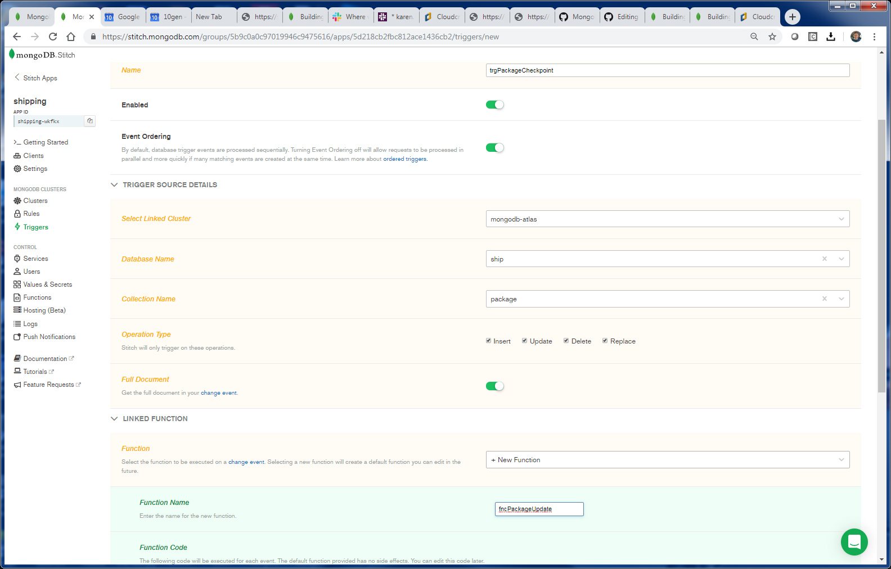

# Shipping: Triggers and Functions
_Solution Architect Author_: [Britton LaRoche](mailto:britton.laroche@mongodb.com)   

## Tutorial Contents 
(Note: All HR tutorials are hands on and should take an estimated time of less than 20 minutes)
1. [Overview](../../)
2. [Accesing shipment data through a REST based API](../rest/README.md)
3. [Triggers and Functions](../triggers/README.md)
4. [Query Anywhere](../queryAnywhere/README.md)
4. [Importing from GitHub: Stitch Command Line tool](../cli/README.md)
5. [Host your application tutorial](../hosting/README.md)  


## Overview
We need to keep changes made to the package collection in sync with the shipping collection.  Our analysis shows that Pronto's shipping application will be 80% reads and 20% writes.  In order to make the reads efficent we will make changes on the shipping document through an Atlas trigger when the package collection is updated.


We will also update a checkpoint collection to implement the versioning design pattern.  We will keep a version of each docuemnt as it passes through each checkpoint.  Notice that the diagram above shows the Atlas trigger and fucntion executing in the stitch serverless framework.  The execution of the code in the trigger takes place outside of Atlas and will not impact database performance. 

## 1. Create the Package Trigger

__trgPackageCheckpoint__   
__fncPackageUpdate__   



```js
exports = function(changeEvent) {
  /*
    A Database Trigger will always call a function with a changeEvent.
    Documentation on ChangeEvents: https://docs.mongodb.com/manual/reference/change-events/

    Access the _id of the changed document:
    var docId = changeEvent.documentKey._id;

    Access the latest version of the changed document
    (with Full Document enabled for Insert, Update, and Replace operations):
    var fullDocument = changeEvent.fullDocument;

    var updateDescription = changeEvent.updateDescription;

    See which fields were changed (if any):
    if (updateDescription) {
      var updatedFields = updateDescription.updatedFields; // A document containing updated fields
    }

    See which fields were removed (if any):
    if (updateDescription) {
      var removedFields = updateDescription.removedFields; // An array of removed fields
    }

    Functions run by Triggers are run as System users and have full access to Services, Functions, and MongoDB Data.

    Accessing a mongodb service:
    var collection = context.services.get("mongodb-atlas").db("db_name").collection("coll_name");
    var doc = collection.findOne({ name: "mongodb" });

    To call other named functions:
    var result = context.functions.execute("function_name", arg1, arg2);
  */


  console.log("Function fncPackageUpdate called ... executing..." );
  
  var shipment = context.services.get("mongodb-atlas").db("ship").collection("shipment");
  var checkpoint = context.services.get("mongodb-atlas").db("ship").collection("checkpoint");
  var fullDocument = changeEvent.fullDocument;
  var fullCopy = fullDocument;
  
  //update the shipping document with the new package information
  console.log("Shipment updateOne ... executing..." );
  console.log("fullDocument");
  console.log(JSON.stringify(fullDocument));
  shipment.updateOne(
  	{ shipment_id: parseInt(fullDocument.shipment_id) },
  	{ $pull: { "packages": { package_id: fullDocument.package_id } }	}
  );
  
  console.log("Shipment ... $addToSet..." );
  shipment.updateOne(
  	{ shipment_id: parseInt(fullDocument.shipment_id) },
  	{ $addToSet: { "packages": { 
  	  package_id: fullDocument.package_id, 
  	  tag_id: fullDocument.tag_id, 
  	  type: fullDocument.type, 
  	  tracking: fullDocument.tracking, 
  	  description: fullDocument.description, 
  	  last_event: fullDocument.last_event, 
  	  location: fullDocument.location, 
  	  last_modified: fullDocument.last_modified, 
  	  fullDocument } } }
  );
  
  //track all changes to the package in the checkpoint collection
  fullCopy.parent_id = fullDocument._id;
  delete fullCopy._id;
  checkpoint.insertOne(fullCopy);

};
```

Again, thinking of these objects as a set of building blocks, the solution is easy to visualize.  We will insert data through the REST API into the database where the collection is being watched by a trigger in stitch.  The trigger will fire a function with logic to update two other collections the shipment collectoion and the checkpoint collection.  The whole design in building blocks looks like the following.


