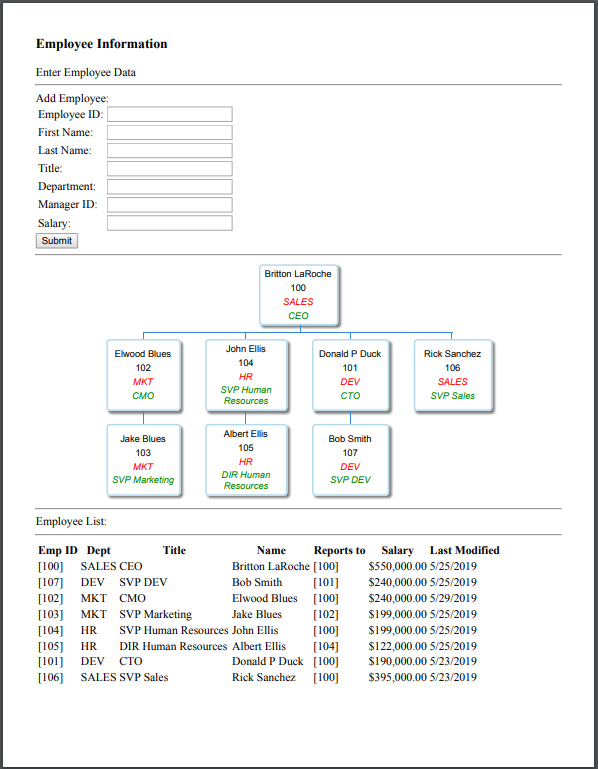

## Embedding Org Charts
_SA Author_: [Britton LaRoche](mailto:britton.laroche@mongodb.com)   
(Note this tutorial build's on the [Employee Tutorial](../employee))

### Tutorial Contents 
1. [MongoDB blog tutorial](https://docs.mongodb.com/stitch/tutorials/blog-overview/)
2. [Atlas Triggers and Functions: Employee tutorial](https://github.com/brittonlaroche/MongoDB-Demos/edit/master/Stitch/employee/)
3. [Stitch Query Anywhere tutorial](https://github.com/brittonlaroche/MongoDB-Demos/edit/master/Stitch/rest)
4. [Embed Atlas Charts in your app tutorial](https://github.com/brittonlaroche/MongoDB-Demos/edit/master/Stitch/charts)
5. [Embed Google Charts tutorial](https://github.com/brittonlaroche/MongoDB-Demos/edit/master/Stitch/charts-google) 
6. [Embed an Org Chart tutorial](https://github.com/brittonlaroche/MongoDB-Demos/edit/master/Stitch/charts-org) 
7. [Host your application tutorial](https://github.com/brittonlaroche/MongoDB-Demos/edit/master/Stitch/hosting) 

## Google Org chart overview
Google has a number of easily imported charting functions that you can imbed in your stitch application with minimal coding effort. In this tutorial we show how to embed a google org chart into your basic employee application. The data is loaded directly from stitch into a data object that is passed into the draw chart function.

The result is shown below:      

   

Google charts are a good alternative to Atlas charts, but they do require coding and additional effort to set up.  Atlas charts require no code and can be easily created in the Atlas Charts intuitive interface and quickly embeded as an iframe.  This tutorial is merely to show another method of adding another set of charts to your application. In this case an Org chart was chosen as this type of chart does not yet exist in Atlas charts.

No effort was put into beautifying the html page, no css or framework was added to the html, to keep it in its most simple and pure form. The image above was generated by selecting "file/print" from the browser menu. It may not be pretty, but its simple, elegant and powerful.  Lets get started.  

### Source file
The completed source file is in the link here [Employee Org Chart](employeeOrgChart.html), you can click the link and copy the html into a text editor.  Change 'your-app-id' to the application displayed in your stitch console.  

```
const client = stitch.Stitch.initializeDefaultAppClient('your-app-id');
```

Save the file as employeeOrgChart.html and double click to see the reports generated for your employee application in the browser.  The rest of this tutorial explains how to create this file from the original employee.html covered in the [Atlas Triggers and Functions: Employee tutorial](https://github.com/brittonlaroche/MongoDB-Demos/edit/master/Stitch/employee/)
