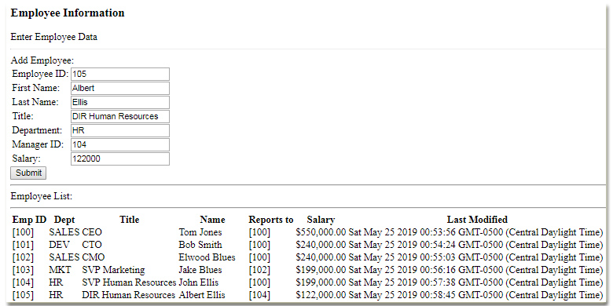

## Overview 
In this short tutorial we are going to create a Human Reousrces appliaction that tracks changes to employees over time.  To accomplish this we will modify our blog tutorial by adding fields and using an upsert into a new HR database with an employees collection. We will add a trigger to take the full document into a collection 


## 1. Create a new stitch app
Log in to atlas from https://cloud.mongodb.com. Create a new stitch app by selecting "Stitch" from the left menu pain. 
Click the button "Create New Stitch App. Type in "HumanResources" (no spaces) for the application name and click the create button in the lower right.


## 2. Configure the stitch application
After the application in created click the "HumanResources" stitch application to enter into the applications stitch console
### Turn on anonymous authentication 
Enable aunonmous authentication by moving the slider button to the right.
### Initialize a MongoDB Collection
Specify a new collection where application will write data.  Use the database name "HR" and the collection name "employees" (note the names are case sensitive)

## 3. Create the browser client application
Download the [employee.html](./employee.html) file (right click save link as) and save it to a directory of your choosing.  Open the file in the text editor of your choice and change the line:    
``` const client = stitch.Stitch.initializeDefaultAppClient('your-app-id'); ```    
by replacing your-app-id with the APP ID displayed in the upper left of your stitch console.  Enter some data, be sure to fill in the employee_id field with a unique number.  For example start with 100 and then add another employee with and id of 101, next 102 etc... You can have the employee 101 use a manager id of 100.   

You should see something like the following   


## 4. Create a trigger to track changes to employees over time
In the left hand navigation pannel of the stitch console select "Triggers" and then click the "Add a trigger" button.  

Name the new trigger "trgEmployeeHist" Select the your clsuer from the "Select Linked Cluster" drop down.  Select "HR" for the database and "employees" for the collection. Check all the boxes for the opertaion type "Insert, Update, Delete and Replace." Finally be sure to move the slider to get the full document.   

In the linked function drop list select "+ New Function" and give the function a name of "fncEmployeeHist" and then save the trigger.  Be sure to keep all the sample documentation, we will need it for a future step.

## 5. Create two new history collections

## 6. Write the history function
