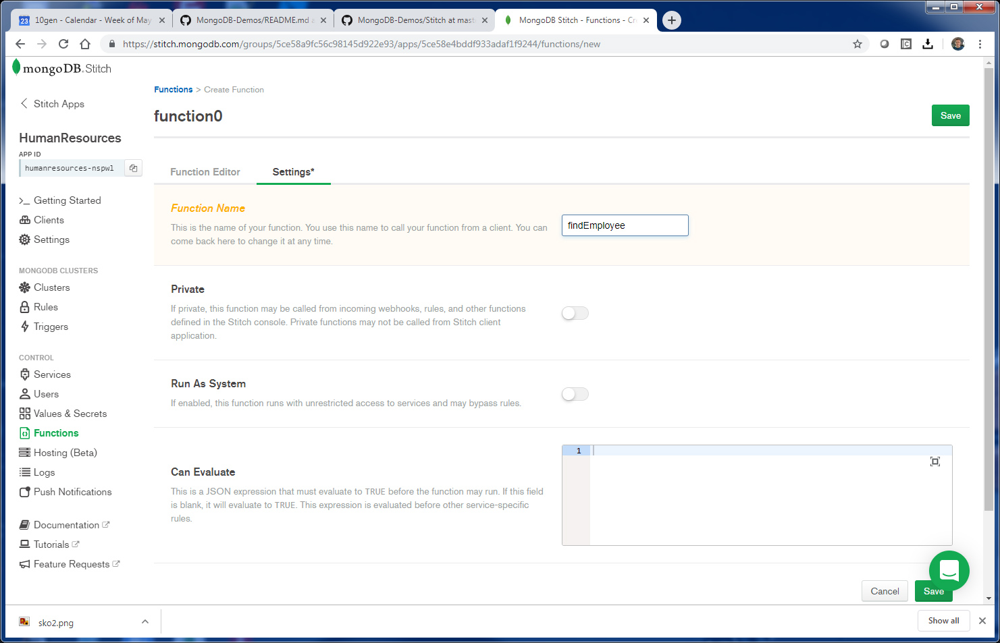
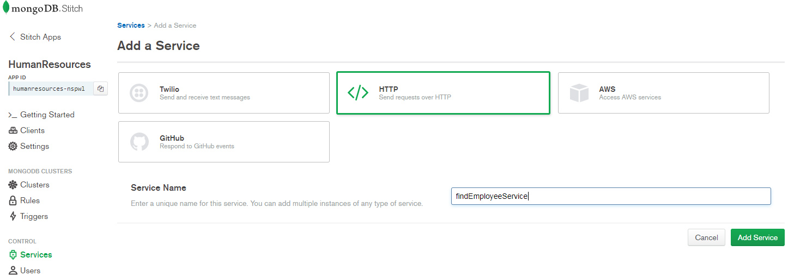
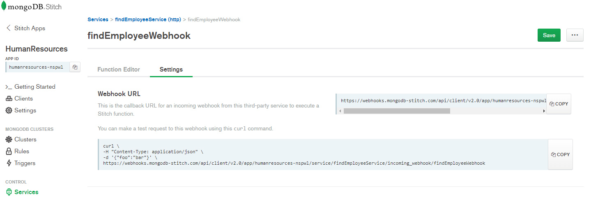

## Atlas Stitch Query Anywhere Overview


In this section we will cover the Stitch query anywhere functionality through a REST based API.  We will create two webhooks that allow employee data to be queried or modified through a REST based API layer.  This surfaces the HR application we built to a wide range of producers and consumers of employee data. Examples include payroll processors, health care providers and mobile devices that allow employees to keep up to date on their payment and benefits data.

### 1. Create a stitch function to query employee data

Select "Functions" from the left navigation panel in the stitch console. Click the "Create New Function" button in the upper right corner.  Give the function a name "findEmployee" and click "Save."  This will bring up the function editor, cut and paste the code below and click "Save."
```
exports = async function( aSearchDoc ){
  /*
    Accessing application's values:
    var x = context.values.get("value_name");

    Accessing a mongodb service:
    var collection = context.services.get("mongodb-atlas").db("dbname").collection("coll_name");
    var doc = collection.findOne({owner_id: context.user.id});

    To call other named functions:
    var result = context.functions.execute("function_name", arg1, arg2);

    Try running in the console below.
  */
  
  console.log(JSON.stringify("Function findEmployee called ... executing..." ));
  var employees = context.services.get("mongodb-atlas").db("HR").collection("employees");
  var doc = employees.findOne(aSearchDoc);
  console.log(JSON.stringify("return document" ));
  console.log(JSON.stringify(doc));
  return doc;
};
```

Notice that we made this function async in the declaration.  This will allow the calling function to await a database response while this function does the work to find the employee specified.  The employee search criteria is specified in the search document passed in as an argument.

### 2. Create a webhook to call the function to query employee data
Select "Servcies" from the left navigation panel in the Stitch Console.  Click the "Add a Service" button. In the add a service dialog select the "HTTP" button and give the service a name "findEmployeeService" and click the "Add Service" button.


Next we add an incoming webhook.  The prompt screen should appear after saving the service.  Click the "Add Incoming Webhook" button. In the add webhook screen give the webhook a name "findEmployeeWebhook" and move the slider to "Respond with Result."  For now we will turn off validation. Click the save button.  


After saving the findEmployeeWebhook the function editor is now present.  Cut and paste the code below and click "Save."

```
// This function is the webhook's request handler.
exports = async function(payload) {
    // Data can be extracted from the request as follows:

    var body = {};
    var result = {};
    if (payload.body) {
      console.log(JSON.stringify(payload.body));
      body = EJSON.parse(payload.body.text());
      console.log(JSON.stringify(body));
      result = await context.functions.execute("findEmployee", body);
    }
    
    return  result;
};
```

Notice that in our webhook function we take in the payload body, which should be a search document, and call our find employee function created earlier.

### 3. Test the search employee REST based API service through postman
Our fist step is to get the new URL for our findEmployeeService. In the findEmployeeWebhook console select the "Settings" tab and click the "Copy" button for the webhook URL.



Next we use postman to test our service.  Create a new collection for MongoDB and add a new post service test. Adda new tab and select "POST" from the drop list. Paste in the URL.  Seelct the "Body" tab and be sure to select RAW JSON(application/json). Click teh save button and name it "Find Employee."

Use something like the following saerch document to find your employee.  Replace "Bob" with the first name you used in setting up your employee data. Hit send and you should get your employee document back. Change first_name to "employee_id" and play around with your data.

``` { "first_name": "Bob"}```


### 4. Create a webhook to call the function add or update employee data

Repeat the steps above to add a new addEmployeeService. 
```
exports = function(payload) {
  var cEmployees = context.services.get("mongodb-atlas").db("Compliance").collection("employees");
  
  var queryArg = payload.query.arg || '';
  var body = {};
  if (payload.body) {
    console.log(JSON.stringify(payload.body));
    body = EJSON.parse(payload.body.text());
    console.log(JSON.stringify(body));
    var nDate = new Date();
    cEmployees.updateOne(
                {employee_id: parseInt(body.employee_id)},
                {$set: {
                    owner_id: "webhook",
                    employee_id: parseInt(body.employee_id),
                    first_name: body.first_name,
                    last_name: body.last_name,
                    title: body.title,
                    department: body.department,
                    manager_id: parseInt(body.manager_id),
                    last_modified: nDate,
                    trace_id: "Emp ID: " + body.employee_id + " - " + nDate.toString()
                    }
                },
                {upsert: true}
            );
  }
  return {"status": "success"};
};
```

### 5. Test the REST based API add employee service through postman

