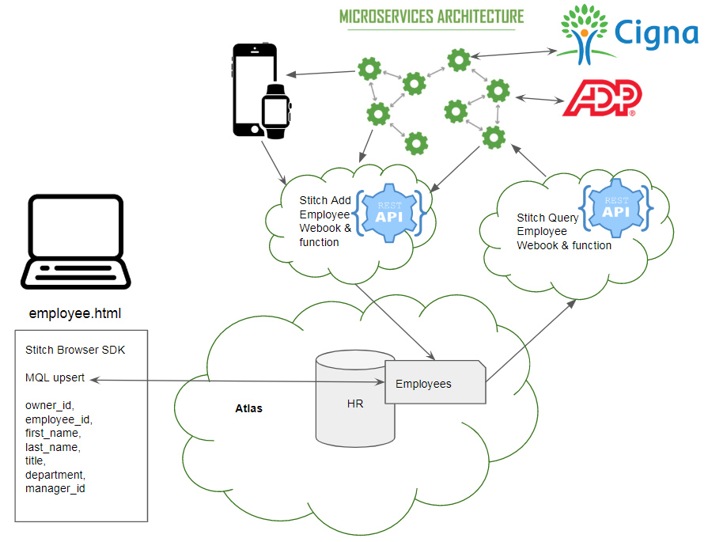
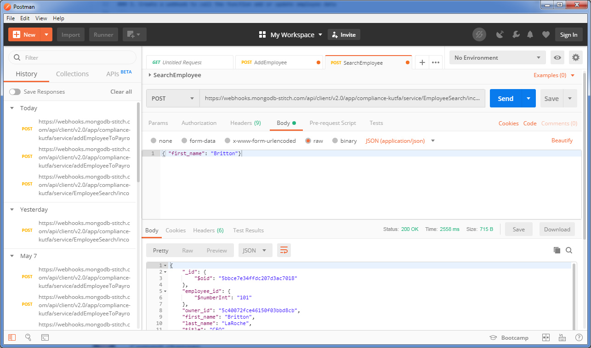

## Stitch Query Anywhere Overview


In this section we will cover the Stitch query anywhere functionality through a REST based API.  We will create two webhooks that allow employee data to be queried or modified through a REST based API layer.  This surfaces the HR application we built to a wide range of producers and consumers of employee data. Examples include payroll processors, health care providers and mobile devices that allow employees to keep up to date on their payment and benefits data.

### 1. Create a stitch function to query employee data
```
exports = async function( aSearchDoc ){
  /*
    Accessing application's values:
    var x = context.values.get("value_name");

    Accessing a mongodb service:
    var collection = context.services.get("mongodb-atlas").db("dbname").collection("coll_name");
    var doc = collection.findOne({owner_id: context.user.id});

    To call other named functions:
    var result = context.functions.execute("function_name", arg1, arg2);

    Try running in the console below.
  */
  
  console.log(JSON.stringify("Function findEmployee called ... executing..." ));
  var employees = context.services.get("mongodb-atlas").db("HR").collection("employees");
  var doc = employees.findOne(aSearchDoc);
  console.log(JSON.stringify("return document" ));
  console.log(JSON.stringify(doc));
  return doc;
};
```

### 2. Create a webhook to call the function to query employee data

```
// This function is the webhook's request handler.
exports = async function(payload) {
    // Data can be extracted from the request as follows:

    var body = {};
    var result = {};
    if (payload.body) {
      console.log(JSON.stringify(payload.body));
      body = EJSON.parse(payload.body.text());
      console.log(JSON.stringify(body));
      result = await context.functions.execute("findEmployee", body);
    }
    
    return  result;
};
```

### 3. Create a webhook to call the function add or update employee data
```
exports = function(payload) {
  var cEmployees = context.services.get("mongodb-atlas").db("Compliance").collection("employees");
  
  var queryArg = payload.query.arg || '';
  var body = {};
  if (payload.body) {
    console.log(JSON.stringify(payload.body));
    body = EJSON.parse(payload.body.text());
    console.log(JSON.stringify(body));
    var nDate = new Date();
    cEmployees.updateOne(
                {employee_id: parseInt(body.employee_id)},
                {$set: {
                    owner_id: "webhook",
                    employee_id: parseInt(body.employee_id),
                    first_name: body.first_name,
                    last_name: body.last_name,
                    title: body.title,
                    department: body.department,
                    manager_id: parseInt(body.manager_id),
                    last_modified: nDate,
                    trace_id: "Emp ID: " + body.employee_id + " - " + nDate.toString()
                    }
                },
                {upsert: true}
            );
  }
  return {"status": "success"};
};
```

### 4. Call the REST based API webhook through postman

