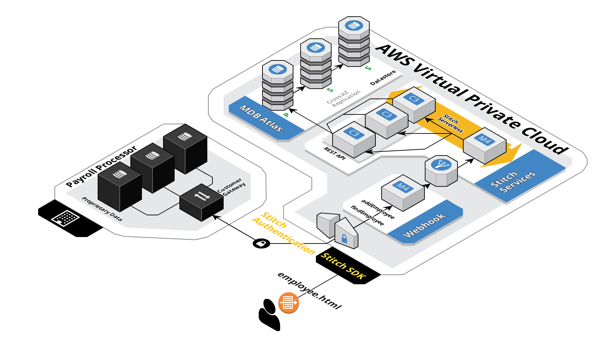
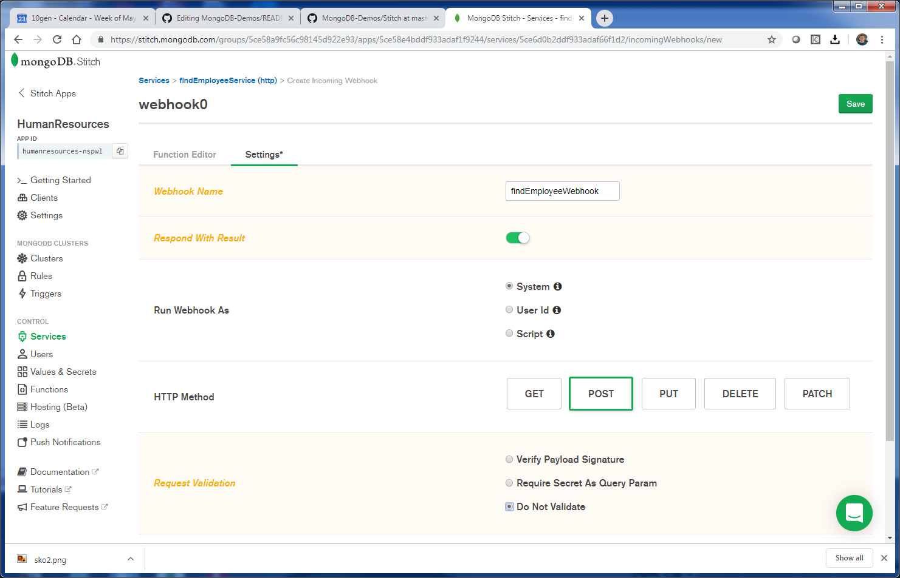
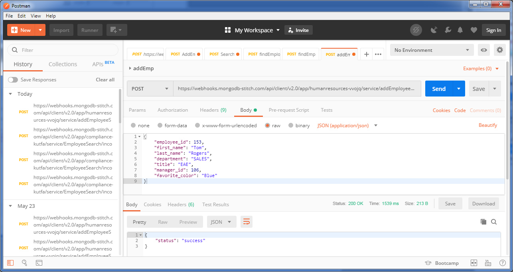
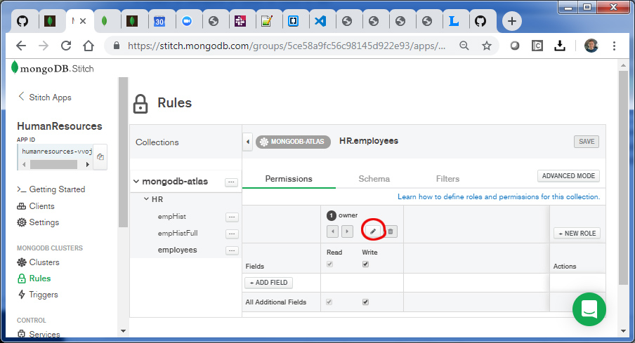

## Atlas - Stitch Serverless Rest Based API (Query Anywhere)

_SA Author_: [Britton LaRoche](mailto:britton.laroche@mongodb.com)   
(Note: this tutorial build's on the [Employee Tutorial](../employee))

### Tutorial Contents 
1. [MongoDB blog tutorial](https://docs.mongodb.com/stitch/tutorials/blog-overview/)
2. [Atlas Triggers and Functions: Employee tutorial](https://github.com/brittonlaroche/MongoDB-Demos/edit/master/Stitch/employee/)
3. [Stitch Query Anywhere tutorial](https://github.com/brittonlaroche/MongoDB-Demos/edit/master/Stitch/rest)
4. [Embed Atlas Charts in your app tutorial](https://github.com/brittonlaroche/MongoDB-Demos/edit/master/Stitch/charts)
5. [Embed Google Charts tutorial](https://github.com/brittonlaroche/MongoDB-Demos/edit/master/Stitch/charts-google) 
6. [Embed an Org Chart tutorial](https://github.com/brittonlaroche/MongoDB-Demos/edit/master/Stitch/charts-org) 
7. [Host your application tutorial](https://github.com/brittonlaroche/MongoDB-Demos/edit/master/Stitch/hosting) 

## Atlas - Stitch Query Anywhere Overview
In this section we will cover the Stitch query anywhere functionality through a REST based API.  We will create two webhooks that allow employee data to be queried or modified through a serverless REST based API layer.  This surfaces the HR application we built to a wide range of producers and consumers of employee data.   

   

Examples include payroll processors, health care providers and mobile devices that allow employees to keep up to date on their payment and benefits data. This stitch layer is serverless and no setup or configuration of additional servers are required.

### Prerequisites
1. [Postman](https://www.getpostman.com/downloads/) or curl   
2. Create an [Atlas cluster](https://docs.atlas.mongodb.com/getting-started/)   
3. Create a Stitch Application: log into [Atlas](cloud.mongodb.com) select "Stitch" on the left navigation pane and create a new application.
4. Not required, but nice to have: [employee.html](../employee/employee.html). Copy and paste code into a text editor, change 'your-app_id' to the APP ID of your stitch application, and save as employee.html. Double click employee.html to bring up in a browser.

### 1. Create a stitch function to query employee data
Create a new function named: __findEmployee__   


Select "Functions" from the left navigation panel in the stitch console. Click the "Create New Function" button in the upper right corner.  Give the function a name __"findEmployee"__ and click "Save."  This will bring up the function editor, cut and paste the code below and click "Save."
```
exports = async function( aSearchDoc ){
  /*
    Accessing application's values:
    var x = context.values.get("value_name");

    Accessing a mongodb service:
    var collection = context.services.get("mongodb-atlas").db("dbname").collection("coll_name");
    var doc = collection.findOne({owner_id: context.user.id});

    To call other named functions:
    var result = context.functions.execute("function_name", arg1, arg2);

    Try running in the console below.
  */
  
  console.log(JSON.stringify("Function findEmployee called ... executing..." ));
  var employees = context.services.get("mongodb-atlas").db("HR").collection("employees");
  var doc = employees.findOne(aSearchDoc);
  console.log(JSON.stringify("return document" ));
  console.log(JSON.stringify(doc));
  return doc;
};
```

Notice that we made this function async in the declaration.  This will allow the calling function to await a database response while this function does the work to find the employee specified.  The employee search criteria is specified in the search document passed in as an argument.

### 2. Create a webhook to call the function to query employee data
Select "Services" from the left navigation panel in the Stitch Console.  Click the "Add a Service" button. In the add a service dialog select the "HTTP" button and give the service a name "findEmployeeService" and click the "Add Service" button.   


Next we add an incoming webhook.  The prompt screen should appear after saving the service.  Click the "Add Incoming Webhook" button. In the add webhook screen give the webhook a name "findEmployeeWebhook" and move the slider to "Respond with Result."  For now we will turn off validation. Click the save button.  



After saving the findEmployeeWebhook the function editor is now present.  Cut and paste the code below and click "Save."

```
// This function is the webhook's request handler.
exports = async function(payload) {
    // Data can be extracted from the request as follows:

    var body = {};
    var result = {};
    if (payload.body) {
      console.log(JSON.stringify(payload.body));
      body = EJSON.parse(payload.body.text());
      console.log(JSON.stringify(body));
      result = await context.functions.execute("findEmployee", body);
    }
    
    return  result;
};
```

Notice that in our webhook function we take in the payload body, which should be a search document, and call our find employee function created earlier.

### 3. Test the search employee REST based API service through postman
Our first step is to get the new URL for our findEmployeeService. In the findEmployeeWebhook console select the "Settings" tab and click the "Copy" button for the webhook URL.


Next we use postman to test our service. If you do not have Postman you can get Postman for free here [Postman Downloads](https://www.getpostman.com/downloads/).

In postman create a new collection for MongoDB and add a new post service. Add a new tab and select "POST" from the drop list. Paste in the URL.  Select the "Body" tab, and be sure to select RAW JSON(application/json). Click the save button and name it "Find Employee."

Use something like the following search document to find your employee.  Replace "Bob" with the first name you used in setting up your employee data. Hit send and you should get your employee document back. Change first_name to "employee_id" and play around with your data.

``` { "first_name": "Bob"}```


### 4. Create a webhook to call the function add or update employee data
Repeat steps 2 and 3 above above to add a new "addEmployeeService" in the webhook function editor cut and paste the code below.  
Create a new HTTP Service named: __addEmployeeService__   
Create a new Webhook named: __addEmployeeWebhook__   

After the webhook is created paste the following script into the __addEmployeeWebhook__ function editor and click save. 

```
exports = async function(payload) {
  var cEmployees = context.services.get("mongodb-atlas").db("HR").collection("employees");
  console.log("Executing addEmployeeWebhook");
  var queryArg = payload.query.arg || '';
  var body = {};
  var result = { "status": "Unknown: Payload body may be empty"};
  
  if (payload.body) {
    console.log(JSON.stringify(payload.body));
    body = EJSON.parse(payload.body.text());
    console.log(JSON.stringify(body));
    var nDate = new Date();
    //check the employee_id
    if ( body.employee_id ) {
        console.log("updating employees collection");
        cEmployees.updateOne(
                    {employee_id: parseInt(body.employee_id)},
                    {$set: {
                        owner_id: "webhook",
                        employee_id: parseInt(body.employee_id),
                        first_name: body.first_name,
                        last_name: body.last_name,
                        title: body.title,
                        department: body.department,
                        manager_id: parseInt(body.manager_id),
                        last_modified: nDate,
                        trace_id: "Emp ID: " + body.employee_id + " - " + nDate.toString()
                        }
                    },
                    {upsert: true}
                );
        console.log("after update");
    } else {
      result = { "status": "Error: employee_id is not present"};
      return result;
    }

    // Let's return the document we find after creating the employee 
    var searchDoc = { "employee_id": parseInt(body.employee_id)};
    result = await context.functions.execute("findEmployee", searchDoc);
  }
  return  result;
};
```

The function above checks the payload body and for the presence of an employee_id.  If either is missing it will return a document with a status of error or unknown.  If it is successful in creating the employee, it will search for the employee and return the newly created document.  This ties together many concepts as addEmployeeWebhook function calls the findEmployee function asynchronously and awaits the result.  This is not the default behavior, to get the function to run asynchronously we have to add the following __"async"__ keyword to the function declaration.

```
exports = async function(payload) {
```

The standard is not to run in async mode.

```
exports = function(payload) {
```

The result for the default synchronous behavior would be an empty or undefined return document.  If you are not aware of the  __"async"__ keyword, which is required for database look ups when calling another function, it might take some time to figure out why the return document is always null or undefined.  

### 5. Test the REST based API add employee service through postman
Next we use postman to test our service.  Add a new tab and select "POST" from the drop list. Paste in the addEmployeeWebhook URL.  Select the "Body" tab, and be sure to select RAW JSON(application/json). Click the save button and name it "Add Employee."   



Once postman is configured, use the json template below by pasting it in the postman body to add a new employee.  Change the employee_id and manager_id, title and department to fit into your organization.  

```
{ 
"employee_id": 121,
"first_name": "Tom",
"last_name": "Tucker",
"department": "SALES",
"title": "EAE",
"manager_id": 100"
}
```

Verify he or she was added as an employee by refreshing your employee.html application, or view the changes in the Atlas "collection" browser.  The employee should show up in compass, and the atlas collection browser but not in your employee.html application.  The reason is the owner_id of the webhook is not the same as the owner_id of the application. The stitch rules need to be changed.  

Open the rules editor by selecting the "Rules" menu item in the left navigation pane.  We need to remove the rule which matches the owner_id to the user id. Click the edit icon for the owner shaped like a pencil.



```
{
  "owner_id": "%%user.id"
}
```

This rule matches the owner_id inserted in the app to the anonymous user we created for authentication.  This works well for the data entered from the employee.html, but not from other sources. Change the rule to be an empty document.

```
{}
```
Save the changes in the rules editor by clicking the save button in the upper right. Refresh the employee.html in the browser and you should see the employees recently added through the rest API webhook.

## Next Steps
Add some charts to your application with the [Embed Atlas Charts](https://github.com/brittonlaroche/MongoDB-Demos/edit/master/Stitch/charts) tutorial.


