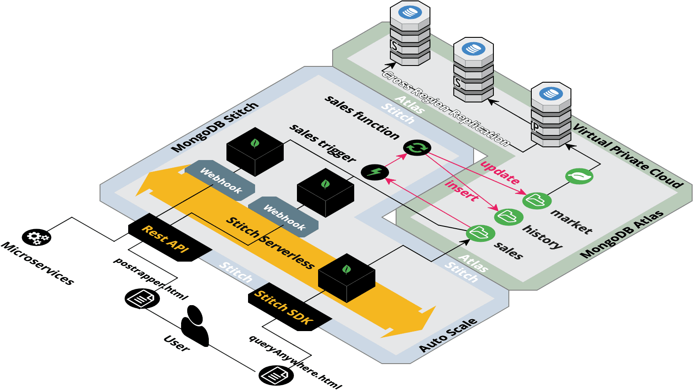
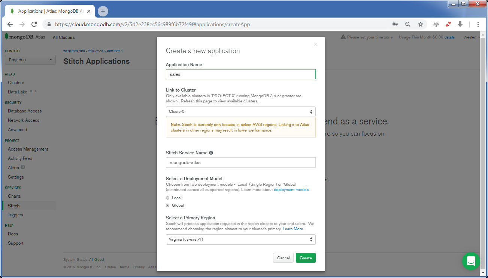
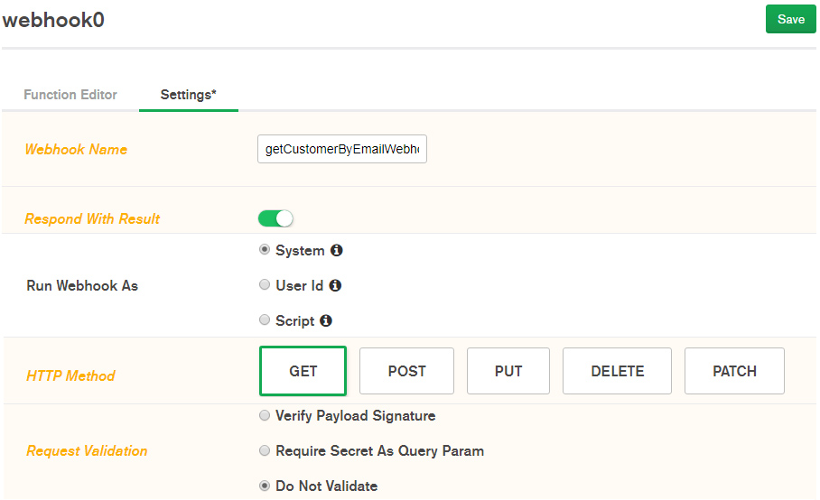
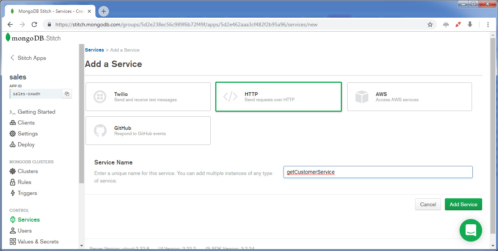
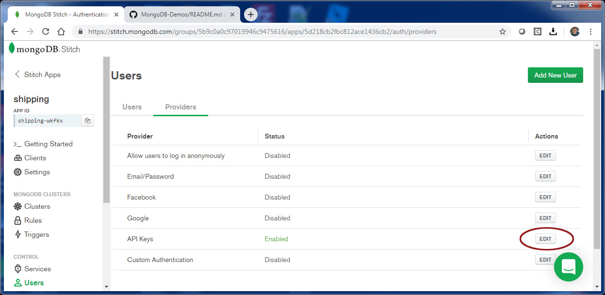
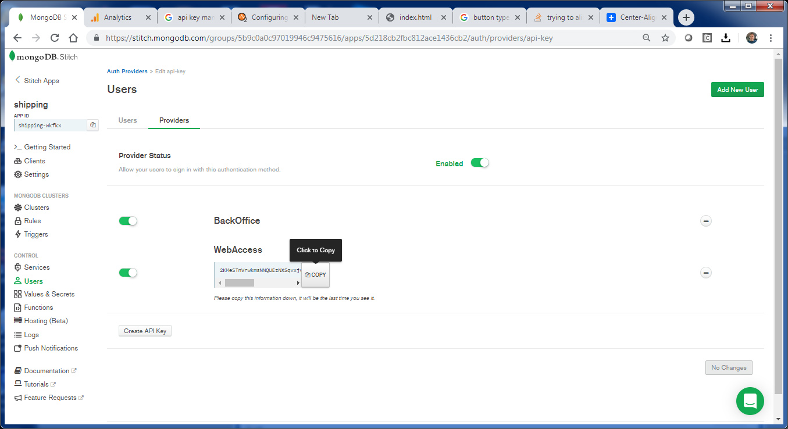
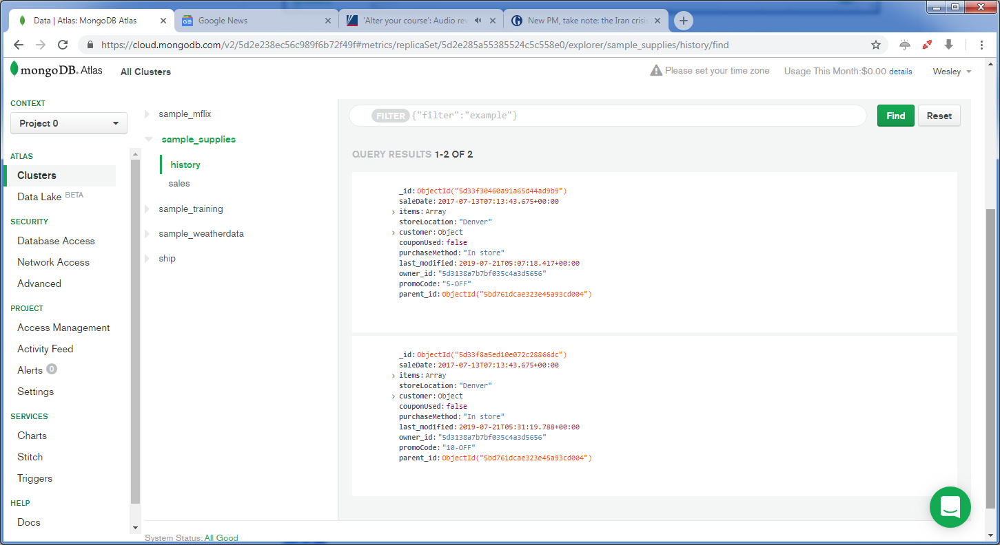
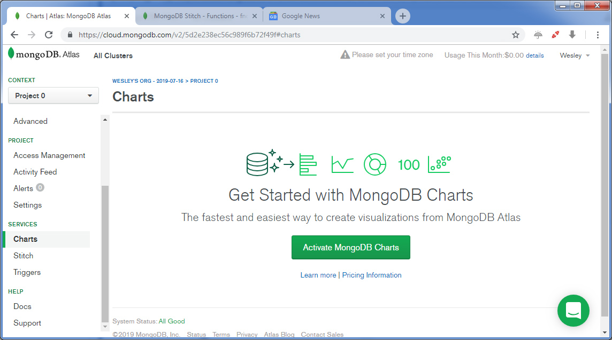

# Atlas and Stitch - Quick Start Hands on Lab

## Contents
[1. Create your first Atlas cluster](#-create-your-first-atlas-cluster)   
[2. Load Sample Data](#-load-sample-data)   
[3. Query the Sample data](#--query-the-sample-data)   
[4. Create a Stitch Application](#-create-a-stitch-application)     
[5. Create a Stitch function to query customer data](#-create-a-stitch-function-to-query-customer-data)  
[6. Create a Stitch service to expose the search function as a REST API](#-create-a-stitch-service-to-expose-the-search-function-as-a-rest-api)   
[7. Create a webpage to show the document from the search service](#-create-a-webpage-to-show-the-document-from-the-search-service)   
[8. Create a user with an API key](#-create-a-user-with-an-api-key)   
[9. Create a web application for a marketing promotion](#-create-a-web-application-for-a-marketing-promotion)   
[10. Create a trigger to capture changes to sales data](#-create-a-trigger-to-capture-changes-to-sales-data)   
[11. Modify the trigger to capture marketing data](#-modify-the-trigger-to-capture-marketing-data)   
[12. Create an Atlas Chart](#-create-an-atlas-chart)   
[13. Embed the Atlas chart in your application](#-embed-the-atlas-chart-in-your-application)   
[14. Host your application](#-host-your-application)   
[15. Stitch Command Line - CICD Integration](#-stitch-command-line---cicd-integration)   

# Overview
Our lab is designed to teach Atlas and Stitch as quickly as possible with no dependencies.  You will only need a browser and a text editor. We will create a free tier Atlas cluster, load in some sample data and explore document data model.  We will learn some basic queries against the document datamodel.  Next we will create our first stitch application and query the database.  We will enable the Stitch serverlss REST API to access and update data.  We will create a stitch trigger and finally a QueryAnywhere browser SDK application.



The diagram above shows us all the objects we will be creating in this quick tutorial and how they interact.  The next 12 steps will give you the understanding you need to develop your own application using Atlas and Stitch.

##  Create your first Atlas cluster

Open a modern browser and go to https://cloud.mongodb.com.  Register for an atlas account by clicking the __"get started free"__ button.


Click the __"get started free"__ button.  This will bring up a screen for you to enter your personal information.

   

Fill in your personal information.  Feel free to use your work or personal email address, either is fine as this is your personal "free for life" development environment.  Agree to the terms of service and click the __"get started free"__ button.  


   

This will bring up window promptin you to build your first cluster.  Click the __"build your first cluster"__ button.  When prompted select "Learning MongoDB" as to the reason you are interested in Atlas. After clicking the Click the __"build your first cluster"__ button, you will be prompted to name your cluster.  "

   

__"Cluster0"__ is the default name and works well for importing data and projects later. Click the __"Create Cluster"__ button at the bottom and your cluster will be ready in the next 7 to 10 minutes.

##  Load Sample Data

Once we have our cluster created the next step is to load data and explore the document structure.  Atlas provides sample data that helps viusalize some examples.  

   
On the main screen for the __"Cluster0"__ home page you will notice four buttons, "Connect", "Metrics", "Collections" and  three dots "..." Click the button labeled with three dots __"..."__ to see a menu list of items.  Select the menu item __"Load Sample Dataset"__

After the sample data is loaded, we will want to see the data and explore the document datamodel.  Lets click the __"Collections"__ button and explore the databases and collections we just loaded.

 

Navigate to the __"samples_supplies"__ database namespace and expand the database to see the sales collection.  Click the __"sales"__ collection and the sales data is displayed in document format.  If you hover over the first document a __">"__ arrow will appear in the upper left, pressing the button will expand the document and show all the values in nested arrays.

##   Query the Sample data

We can create a simple query to pull back sales data for the store located in austin with the following document query:   

```{"storeLocation": "Austin"}```   

Type this in query in the filter section and press the __"Find"__ button.

 

We can try other locations as well.   
```{"storeLocation": "Denver"}```   

We can do a more advanced find.  We have been asked to generate a report on customers who were of retirement age to offer a promotion and a special discount on their next purchase.  The customer is an object embeded in the sales document and we need to refrence the age demographic value.  A simple nested query with dot notaion will allow us to get all the customers greater than or equal to 65 years of age.   

``` 
{"customer.age":  {$gte: 65}}
```  
After looking at the data Denver has been selected to test the theory that offering a discount on supplies will create an incentive for people who have retrired to greatly increase the number of items they purchase.   

##  Create a Stitch Application   
Our next step is to create an application to query the sales data and offer promotional discounts to customers who live in Denver and are of retirement age.  We will begin by creating our stitch application.  This task is accomplished by selecting __"Stitch"__ from the left hand navigation menu of the cluster we just created.


We click the large green button labeled __"Create new Application"__ and give the application a name.  In this case we will name our application __"sales"__   



Click the little green __"Create"__ button in the lower right hand of the popup window.  The stitch application console will appear as soon as the application has been created and linked with the cluster. 

##  Create a stitch functions to query customer data
There are some basic ways to query data via the stitch REST based API.  One is through a GET with a query parameter. Another method is through a POST by passing in a searhc document.  We will cover both methods.

### Query Parameters
Lets begin with building a function that takes a query parameter.  From the left hand navigation menu of the Stitch console select __"Functions"__  click the __"Create New Function"__ button and give the new function an name of __"findCustomerByEmail"__.  Make sure the function runs as system to bypass rules as we have not set up any rules at this point in the workshop.  


Click the save button and you will be preseneted with the function editor.  Cut and paste the code below.

```js
exports = async function(arg){

    var collection = context.services
        .get("mongodb-atlas").db("sample_supplies").collection("sales");
    var doc = await collection.findOne({ "customer.email": arg});
    if (typeof doc == "undefined") {
        return `No customers with email ${arg} were found.`;
    }
    return doc;
}
```
Notice two important key words; __"async"__ and __"await"__ these keywords are not the default.  You have to specify this function is aync and tell it to await the result from the findOne query to return a document.  


Click on the console tab and type in the following email parameter to find a sales document with a customer email.


```exports('div@me.it')```   
click the run button and view the returned document in the __"results"__ tab.


### Search Document
Our first function took in an email address and returned a matching sales document.  This is a great first step.  Now we have to write a new function for every possible argument or combination of arguments.  Perhaps we want to know all purchases that were online in denver.  We now have to wriet a function that takes in the __"purchaseMethod"__ and __"storeLocation"__.  What about store location and age?  It quickly beomes apparent that we need away to pass in multiple arguments and conduct a query based on them.  How do we do this?  We use a search document.

Lets create a new function that takes a search document.  Select __"Functions"__ from the left hand navigation menu of the stitch console and click the __"Create New Function"__ button.  Name the function __"findCustomer"__  


```js
exports = async function( aSearchDoc ){
  var sales = context.services.get("mongodb-atlas").db("sample_supplies").collection("sales");
  var doc = await sales.findOne(aSearchDoc);
  return doc;
};
```
The above 3 lines of code a quite terse but extremely powerful.  Sometimes it helps to do a bit of debugging.  Logging data to the console is helpful.  In order to log the conetents of a document we have a helper function __"JSON.stringify"__ an example of logging the documents passed into and out of the search function is provided below.  If you would like to add in some logging to our search function cut and paste the code below into the __"findCustomer"__ function.

```js
exports = async function( aSearchDoc ){
  console.log("Function findCustomer called ... executing..." );
  var sales = context.services.get("mongodb-atlas").db("sample_supplies").collection("sales");
  console.log("Function findCustomer Search document");
  console.log(JSON.stringify(aSearchDoc));
  var doc = await sales.findOne(aSearchDoc);
  console.log("return document");
  console.log(JSON.stringify(doc));
  return doc;
};
```

```js
exports({"customer.email": "div@me.it"})
```


We are no longer limited to searching for any particular field.  Lets find a customer by store location age and gender.

```js
exports({"customer.age": 65, "customer.gender": "F", "storeLocation": "Denver"})
```

##  Create a Stitch service to expose the search function as a REST API

We will now create two HTTP services for our find customer fucntions.   

1. Our __getCustomerByEmailService__ will use a GET request with a query parameter.
2. Our __getCustomerService__ will use a POST request with a json document body.

### getCustomerByEmailService




### getCustomerService



```js
// This function is the webhook's request handler.
exports = async function(payload) {
    // Data can be extracted from the request as follows:

    var body = {};
    var result = {};
    console.log("inside getCustomerWebhook");
    if (payload.body) {
      console.log("Payload body");
      console.log(JSON.stringify(payload.body));
      body = EJSON.parse(payload.body.text());
      console.log("Parsed Payload body");
      console.log(JSON.stringify(body));
      result = await context.functions.execute("findCustomer", body);
    }
    return  result;
};
```


##  Create a webpage to show the document from the search service


```js
        const response = await fetch(webhook_url, {
          method: httpVerb,
          body: inputDoc, // string or object
          headers: {
            'Content-Type': 'application/json'
          }
```


```js
<!DOCTYPE html>
<html>
  <head>
    <meta charset="UTF-8" />
    <title>Postrapper</title>
    <!-- When you need to test a json body in a REST API call, but don't have access to postman. -->
    <!-- Britton LaRoche's Postrapper can get you the results you need!  -->
    <!-- Let's use Bootstrap improve the default look a bit -->
    <link
      rel="stylesheet"
      href="https://maxcdn.bootstrapcdn.com/bootstrap/3.4.0/css/bootstrap.min.css"
    />
  </head>
  <style>
    div {
      margin-left: 40px;
    }
    table td {
      padding: 5px;
    }
  </style>
  <body>
    <div>
      <h2>Postrapper</h2>
      <p>
        This simple page demonstrates json REST based API calls
      </p>
      <form>
        <table>
          <tr><td style="padding: 10">URL:</td><td><input style="min-width: 1000px;" type="text" id="input_url" name="input_url"/></td></tr>
          <tr><td> VERB:</td><td> <input type="text" id="input_verb" name="input_verb" value="POST" /></td></tr>
          <tr><td> Input Document:</td><td> <textarea class="form-control" id="input_json" rows="5"></textarea></td></tr>
          <tr><td> Results: </td><td> <textarea class="form-control" id="results" rows="10"></textarea></td></tr>
        </table>
      </form>
      <br>
      <button type="submit" onclick="sendJson()">Send</button>
    </div>
    <script>
      const sendJson = async () => {
        var txt = "";
        var httpVerb = document.getElementById("input_verb").value;
        var webhook_url = document.getElementById("input_url").value;
        var inputDoc = document.getElementById("input_json").value; 
        console.log(webhook_url);
        const response = await fetch(webhook_url, {
          method: httpVerb,
          body: inputDoc, // string or object
          headers: {
            'Content-Type': 'application/json'
          }
        });
        const myJson = await response.json(); //extract JSON from the http response
        console.log(myJson);
        document.getElementById("results").innerHTML = JSON.stringify(myJson, undefined, 2);
      };
    </script>
  </body>
</html>
```

   

```{"customer.email": "div@me.it"}```   

##  Create a user with an API key
We begin by adding a bit of security and creating an API Key and assoicated user permissions.  This is not necessary as we could create an anonymous user, use a third party athentication method (facebook, google, AWS Cognito, JWT etc..)  Let us quickly explore our options.  Click on the __"Users"__ menu item in the left hand navigation pane in the stitch console.  The users window will display a list of users (we have not created any). Lets click the providers tab at the top of the users window.  We are presented with a list of options as seen below.



Third party providers such as facebook and google provide an excellent way for customers to access data and will be covered at a point in the future.  For now explore the custom option as you can see how to integrate with a Single Sign On (SSO) provider like AWS cognito, or something you are using in house through Java Web Tokens (JWT) as this eliminates the headache of user management for your application.

For now we will generate an API Key.  Select the __"API Keys"__ option and click the edit button.



Type in a name for the API Key, something like "BackOffice" or "WebAccess" and click save.  A private key will be displayed.  Copy that key and paste it into a text editor of your choice.  Then create the api key.  We will use that key to access the database through the stitch browser SDK.

##  Create a web application for a marketing promotion

We will be using the [Mongo DB Stitch Browser SDK](https://docs.mongodb.com/stitch-sdks/js/4/index.html) to create a web based application that turns the browser into a fully functional stitch client.  The client will be able to execute the MongoDb Query Language (MQL) directly from the browser.  This will help us build an application to select specific customers for a promotional offering.


Copy the code from the [QueryAnywhere.html](../html/QueryAnywhere.html) file.  Right click and select "open file in new tab" the [QueryAnywhere.html](../html/QueryAnywhere.html) link click the view raw file button select all the text and paste it in a text editor.  Save the file as QueryAnywhere.html

Replace your your-api-key with the private api key you generated in step 8. You may have to repeat step 8 if you forgot to copy the private API key.  Replace your-app-id with the stitch APP-ID located in the upper left of the stitch console.
```js
      const credential = new stitch.UserApiKeyCredential("your-api-key");
      const client = stitch.Stitch.initializeDefaultAppClient('your-app-id');
```
Example
```js
      const credential = new stitch.UserApiKeyCredential("1kJ3BEMz4LGyvKGhcxqyWi8wAUnFJ8y3O6clY6WAQLIv8D45xM9Az9rVPEjribVZ");
      const client = stitch.Stitch.initializeDefaultAppClient('sales-oxwdn');
```

Double click the file and you should see someting very similar to the following image.


```js
<script src="https://s3.amazonaws.com/stitch-sdks/js/bundles/4.5.0/stitch.js"></script>
```

```js
    <script>
       /* NOTE: handle your API key with another method than what is provided in this example
       * (dont paste your API key in your code its easily obtained by the browser view source)
       * API key is pasted here for a simple prototype example with out key management
       */
      const credential = new stitch.UserApiKeyCredential("1kJ3BEMz4LGyvKGhcxqyWi8wAUnFJ8y3O6clY6WAQLIv8D45xM9Az9rVPEjribVZ");
      const client = stitch.Stitch.initializeDefaultAppClient('sales-oxwdn');
      const db = client.getServiceClient(stitch.RemoteMongoClient.factory,"mongodb-atlas").db('sample_supplies');
      function displayCustomersOnLoad() {
        client.auth
          .loginWithCredential(credential)
          .then(displayCustomers)
          .catch(console.error);
      }
  ```
The best getting started guide with the browser client SDK is [the blog tutorial](https://docs.mongodb.com/stitch/tutorials/blog-overview/).  It consists of two main parts, the [Blog tutorial back end](https://docs.mongodb.com/stitch/tutorials/guides/blog-backend/), and the [Blog tutorial front end](https://docs.mongodb.com/stitch/tutorials/guides/blog-web/).  We will offer a condensed version of the blog tutorial with a couple of new concepts.  It is highly recommended to complete the blog tutorial when you have time.

Additional information on the application of rules and third party authentication can be found in the [todo web app tutorial](https://docs.mongodb.com/stitch/tutorials/todo-overview/)   

##  Create a trigger to capture changes to sales data
Create a new trigger by selecting __"Triggers"__ on the left navigation pane in the stitch console. 


Save the trigger then open the open the newly created function by selecting __"Functions"__ from the left navigation pane in the stitch console.   


Cut and paste the following code in te the function editor.  Save the function and then deploy the changes.
```js
exports = function(changeEvent) {
  
  var sales = context.services.get("mongodb-atlas").db("sample_supplies").collection("sales");
  var history = context.services.get("mongodb-atlas").db("sample_supplies").collection("history");
  var fullDocument = changeEvent.fullDocument;
  var fullCopy = fullDocument;
  
  //update the shipping document with the new package information
  console.log("fncSalesHistoryMarket ... executing..." );
  console.log("fullDocument");
  console.log(JSON.stringify(fullDocument));

  //track all changes to the sales document in the history collection
  fullCopy.parent_id = fullDocument._id;
  delete fullCopy._id;
  history.insertOne(fullCopy);

};
```

Use the QueryAnywhere.html app to select a customer and update the Promo Code field.  Use the data explorer to see the change in the database.  A new history collection with the sales document is added.  Notice the promo code value and last modified time as well as the parent_id field.  

Use the QueryAnywhere.html app to update the Promo Code field to a new value for the same customer.  View the history collection again and you can now see the history of changes to the sales document.  We have implemented [document versioning](https://www.mongodb.com/blog/post/building-with-patterns-the-document-versioning-pattern) through a trigger.  This is part of [building MongoDB Applications with design patterns](https://www.mongodb.com/blog/post/building-with-patterns-a-summary)



##  Modify the trigger to capture marketing data

Edit the function __"fncSalesHistoryMarket"__ and add the logic to update a new marketing collection that has a single document to show just the customer's current promotion.  Copy and paste the code below, save the fucntion and deploy the changes. 

```js
exports = function(changeEvent) {
  
  var sales = context.services.get("mongodb-atlas").db("sample_supplies").collection("sales");
  var history = context.services.get("mongodb-atlas").db("sample_supplies").collection("history");
  var market = context.services.get("mongodb-atlas").db("sample_supplies").collection("market");
  var fullDocument = changeEvent.fullDocument;
  var fullCopy = fullDocument;
  var nDate = new Date();
  
  //update the shipping document with the new package information
  console.log("fncSalesHistoryMarket ... executing..." );
  console.log("fullDocument");
  console.log(JSON.stringify(fullDocument));

  //track all changes to the sales document in the history collection
  fullCopy.parent_id = fullDocument._id;
  delete fullCopy._id;
  history.insertOne(fullCopy);
  
  market.updateOne(
      { email: fullDocument.customer.email },
      {$set: {
          age: fullDocument.customer.age,
          gender: fullDocument.customer.gender,
          promoCode: fullDocument.promoCode,
          storeLocation: fullDocument.storeLocation,
          purchaseMethod: fullDocument.purchaseMethod,
          last_modified: nDate
          },
      },
      {upsert: true}
    );

};
```

Update the QueryAnywhere.html promotion app with a new promo code and view the changes in the new market collection app.


This exersize shows how a single trigger can update multiple collections.  The history collection with versioning shows changes to a document over time, but might be expensive in size, as the number of documents inserted in the collection could grow very large.  The market collection shows how a single small document can constructed and accessed to get the current promotion code in a flat document structure.  Triggers have the power to perform versioning and transform the document structure based on your application needs.

##  Create an Atlas chart 
We want to be able to graphically determine if offering a promotional discount to senior citizens in the Denver store actually increases the number of items they buy.  Do they indeed stock pile office supplies when they are on sale? Our job is to graphically represent the current number of items purchased by each age demographic. Select Charts from the left hand navigation panel of the Atlas Cluster and enable charts.      



Add a new data source.


Select the cluster (we only have one at this time, but we can have more in the future)   


Select the datasource __"Sample_Supplies"__ and then select the __"sales"__ collection to have some familiar data to build a chart against.   


Now we build our chart. We will select a circular chart type.  We name the chart __"Item Quantity by Customer Age."__  Drag customer.age into the __"Label"__ category.  Set the binning on and the numeric value to 25.  This will break the age demographic into groups of 25 years. 

Next we expand the items array and select __"quantity"__, and drag the field into the __"Arc"__ category of the graph. Be sure to unwind the array and sum the quantity for each item.


We now have our chart and we see that the Age 50-75 demographic represendts a healthy portion of all items sold.  

##  Embed the Atlas chart in your application

##  Host your application

##  Stitch Command Line - CICD Integration


