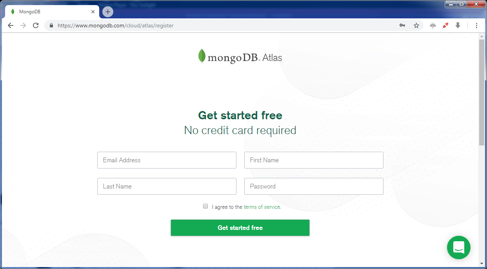
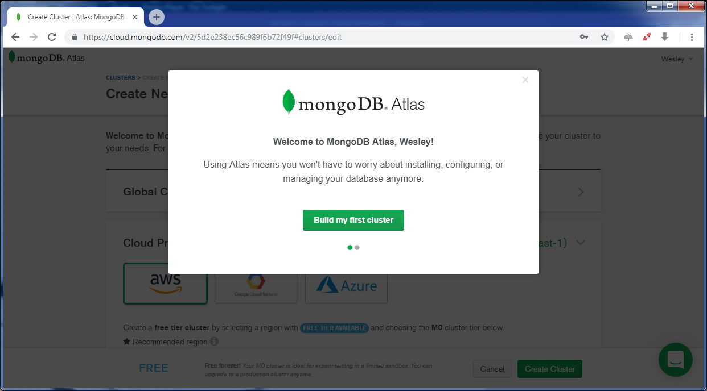
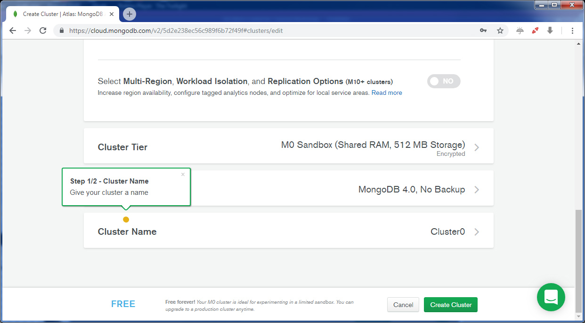
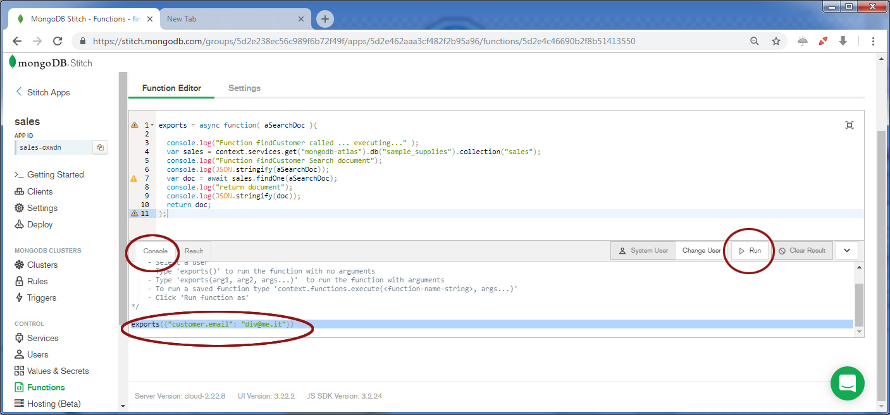

# Atlas and Stitch - Quick Start Hands on Lab

# Overview
Our lab is designed to teach Atlas and Stitch as quickly as possible with no dependencies.  You will only need a browser and a text editor. We will create a free tier Atlas cluster, load in some sample data and explore document data model.  We will learn some basic queries against the document datamodel.  Next we will create our first stitch application and query the database.  We will enable the Stitch serverlss REST API to access and update data.  We will create a stitch trigger and finally a QueryAnywhere browser SDK application.


The diagram above shows us all the objects we will be creating in this quick tutorial and how they interact.  The next 12 steps will give you the understanding you need to develop your own application using Atlas and Stitch.

##  Create your first Atlas cluster

Open a modern browser and go to https://cloud.mongodb.com.  Register for an atlas account by clicking the __"get started free"__ button.


Click the __"get started free"__ button.  Theis will bering up a screen for you to enter your personal information.

   

Fill in your personal information.  Feel free to use your work or personal email address, either is fine as this is your personal "free for life" development environment.  Agree to the terms of service and click the __"get started free"__ button.  


   

This will bring up window promptin you to build your first cluster.  Click the __"build your first cluster"__ button.  When prompted select "Learning MongoDB" as to the reason you are interested in Atlas. After clicking the Click the __"build your first cluster"__ button, you will be prompted to name your cluster.  "

   

__"Cluster0"__ is the default name and works well for importing data and projects later. Click the __"Create Cluster"__ button at the bottom and your cluster will be ready in the next 7 to 10 minutes.

##  Load Sample Data

Once we have our cluster created the next step is to load data and explore the document structure.  Atlas provides sample data that helps viusalize some examples.  

   
On the main screen for the __"Cluster0"__ home page you will notice four buttons, "Connect", "Metrics", "Collections" and  three dots "..." Click the button labeled with three dots __"..."__ to see a menu list of items.  Select the menu item __"Load Sample Dataset"__

After the sample data is loaded, we will want to see the data and explore the document datamodel.  Lets click the "Collections" button and explore the databases and collections we just loaded.

 

Navigate to the __"samples_supplies"__ database namespace and expand the database to see the sales collection.  Click the __"sales"__ collection and the sales data is displayed in document format.  If you hover over the first document a __">"__ arrow will appear in the upper left, pressing the button will expand the document and show all the values in nested arrays.

##   Query the Sample data

We can create a simple query to pull back sales data for the store located in austin with the following document query:   

```{"storeLocation": "Austin"}```   

Type this in query in the filter section and press the __"Find"__ button.

 


We can do a more advanced find.  Suppose you were asked to generate a report on customers who were of retirement age to offer a promotion and a special discount on their next purchase.  The customer is an object embeded in the sales document and we need to refrence the age demographic value.  A simple nested query with dot notaion will allow us to get all the customers greater than or equal to 65 years of age.

``` 
{"customer.age":  {$gte: 65}}
```  

##  Create a Stitch Application   


##  Create a Stitch function to query customer data  


```js
exports = async function( aSearchDoc ){

  console.log("Function findCustomer called ... executing..." );
  var sales = context.services.get("mongodb-atlas").db("sample_supplies").collection("sales");
  console.log("Function findCustomer Search document");
  console.log(JSON.stringify(aSearchDoc));
  var doc = await sales.findOne(aSearchDoc);
  console.log("return document");
  console.log(JSON.stringify(doc));
  return doc;
};
```

```js
exports({"customer.email": "div@me.it"})
```



##  Create a Stitch service to expose the search function as a REST API


```js
// This function is the webhook's request handler.
exports = async function(payload) {
    // Data can be extracted from the request as follows:

    var body = {};
    var result = {};
    console.log("inside getCustomerWebhook");
    if (payload.body) {
      console.log("Payload body");
      console.log(JSON.stringify(payload.body));
      body = EJSON.parse(payload.body.text());
      console.log("Parsed Payload body");
      console.log(JSON.stringify(body));
      result = await context.functions.execute("findCustomer", body);
    }
    
    return  result;
};
```

##  Create a webpage to show the document from the search service

##  Create a user with an API key

##  Create a web application for a marketing promotion

##  Create a trigger to capture changes to sales data

##  Modify the trigger to capture marketing data

##  Create an Atlas Chart


