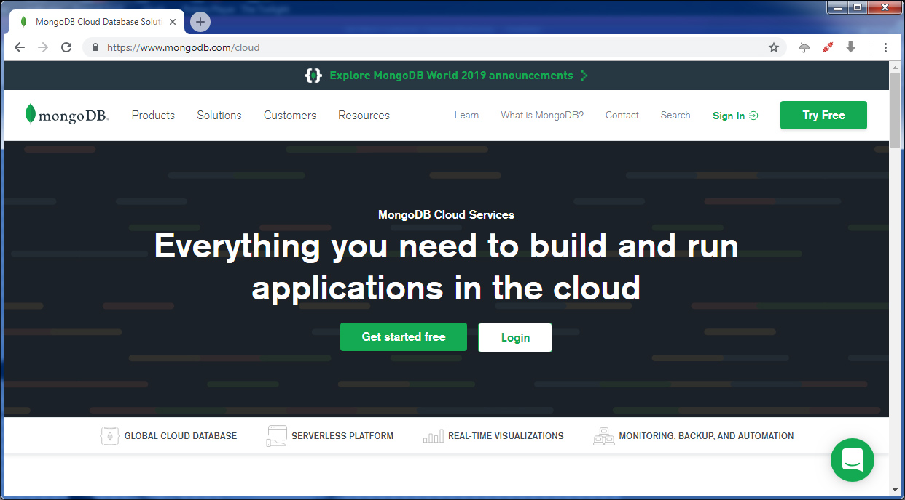

# Atlas and Stitch - Quick Start Hands on Lab

# Overview
Our lab is designed to teach Atlas and Stitch as quickly as possible with no dependencies.  You will only need a browser and a text editor. We will create a free tier Atlas cluster, load in some sample data and explore document data model.  We will learn some basic queries against the document datamodel.  Next we will create our first stitch application and query the database.  We will enable the Stitch serverlss REST API to access and update data.  We will create a stitch trigger and finally a QueryAnywhere browser SDK application.

The diagram above shows us all the objects we will be creating in this quick tutorial and how they interact.

## 1 Create your first Atlas cluster
Open a modern browser and go to https://cloud.mongodb.com.  Register for an atlas account by clicking the __"get started free"__ button.

Click the __"get started free"__ button.  Theis will bering up a screen for you to enter your personal information.

   

Fill in your personal information.  Feel free to use your work or personal email address, either is fine as this is your personal "free for life" development environment.  Agree to the terms of service and click the __"get started free"__ button.  

   

This will bring up window promptin you to build your first cluster.  Click the __"build your first cluster"__ button.  When prompted select "Learning MongoDB" as to the reason you are interested in Atlas. After clicking the Click the __"build your first cluster"__ button, you will be prompted to name your cluster.  "

   

Cluster0" is the default name and works well for importing data and projects later. Click the __"Create Cluster"__ button at the bottom and your cluster will be ready in the next 7 to 10 minutes.

## 2 Load Sample Data
Once we have our cluster created the next step is to load data and explore the document structure.  Atlas provides sample data that helps viusalize some examples.

   

